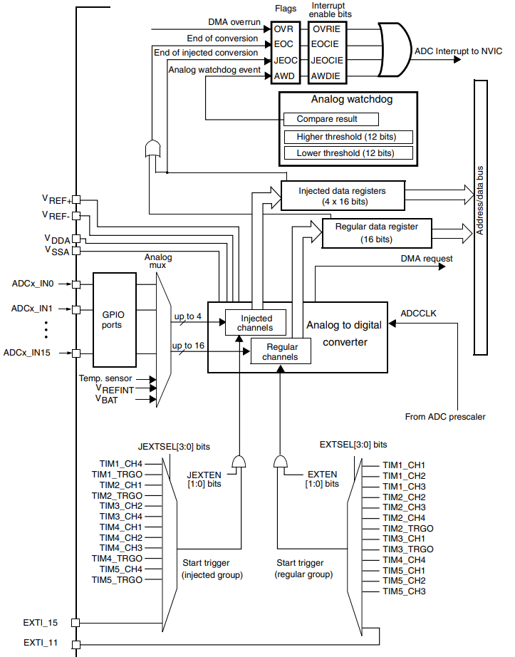
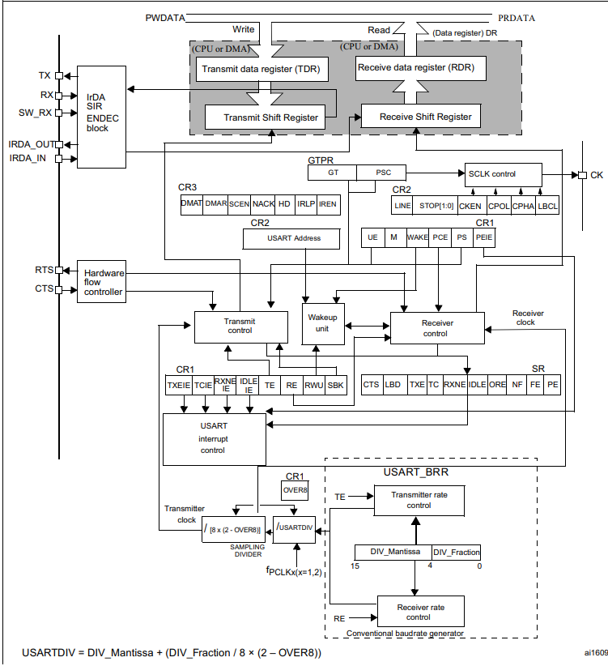
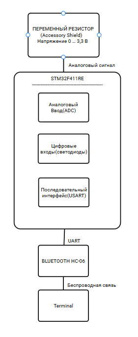

= Курсовая работа
:figure-caption: Рисунок
:toc: macro
:toc-title: Оглавление
:table-caption: Таблица
:sectnums:
:stem:
:eqnums: all

include::Titulnik_salavat.adoc[lines="1..8"]
Разработка устройства индикации напряжения +
Пояснительная записка к курсовому проекту
include::Titulnik_salavat.adoc[lines="11..23"]

toc::[]

== Анализ требований

Общие требования к курсовому проекту представлены в таблице 1.

.Требования к курсовому проекту
[cols="1,1"]
|===
|Параметр, характеристика |Требование

|Отладочная плата
|XNUCLEO-F411RE

|Способ измерения напряжения
|Встроенный АЦП

|Период измерения
|50 мс

|Получение кода измерения
|Механизм DMA

|Измерение/изменение напряжения
|Плата Accessory Shield, переменный резистор

|Точность измерения напряжения
|Не менее 0,01 В

|Общение с платой расширения
|USART2

|Передача значений по беспроводному интерфейсу
|BlueTooth Bee HC-06

|Язык приложения, компилятор
|C++, ARM 8.40.2
|===

=== Уточнение периода измерений

В исходных требованиях установлен период измерения 50 мс, в то время как цифровой фильтр определён с шагом `dt = 100 мс`. Данное противоречие было выявлено в ходе анализа и согласовано с руководителем. Принято решение **увеличить период измерения до 100 мс**, что соответствует периоду работы фильтра. Это позволяет корректно применять цифровую фильтрацию и снизить нагрузку на процессор.

=== Цифровая фильтрация

** К измеренному напряжению должен быть применен цифровой фильтр вида: +
stem:[tau = int  ((1-e^(-dt/(R*C)), RC > 0 sec), (1, RC<= 0 sec))] +
{nbsp} +
stem:["FilteredValue" = "OldFiltered" + ("Value" - "OldValue") * tau], +
{nbsp} +
где dt -  100 мс; +
Value – текущее нефильтрованное измеренное значение напряжения; +
oldValue -  предыдущее фильтрованное значение.

=== Индикация напряжения

Индикация осуществляется с помощью четырёх светодиодов. Правила включения:

* при 0–25% от максимального напряжения — 1 светодиод;
* при 25–50% — 2 светодиода;
* при 50–75% — 3 светодиода;
* при 75–100% — 4 светодиода.

=== Структурная схема устройства

.Общая структурная схема устройства индикации напряжения

== Аппаратная платформа

=== Микроконтроллер и АЦП

В проекте используется 12-битный АЦП, встроенный в микроконтроллер STM32F411RE.

==== Теоретическая и реальная разрешающая способность

Теоретическая разрешающая способность 12-битного АЦП составляет:

[stem]
++++
Q_{теор} = \frac{V_{ref}}{2^{N}} = \frac{3,3}{4096} \approx 0,0008 \text{ В} = 0,8 \text{ мВ}
++++

Однако на практике эффективная разрядность (ENOB — Effective Number of Bits) для данного АЦП составляет около **10,5 бит**. Это связано с наличием шумов квантования, тепловых шумов и нелинейности преобразования. Реальная разрешающая способность с учётом ENOB:

[stem]
++++
Q_{реал} = \frac{V_{ref}}{2^{10,5}} = \frac{3,3}{1448} \approx 0,0023 \text{ В} = 2,3 \text{ мВ}
++++

Тем не менее, даже реальная разрешающая способность (2,3 мВ) более чем в 4 раза превышает требуемую точность 0,01 В (10 мВ), что гарантирует выполнение технического задания.

==== Факторы, влияющие на точность измерения

На точность измерения напряжения влияют следующие факторы:

1. **Температурная нестабильность** — смещение нуля и коэффициента усиления АЦП при изменении температуры окружающей среды. Для STM32F411RE температурный дрейф составляет около ±20 ppm/°C.

2. **Нестабильность опорного напряжения** — АЦП использует питание `V_{ref} = V_{DDA}` (3,3 В). Любые пульсации или просадки питания напрямую влияют на результат преобразования.

3. **Шумы квантования** — возникают из-за конечной разрядности АЦП.

4. **Апертурная неопределённость** — вариации момента взятия выборки, вызванные джиттером тактового сигнала.

5. **Нелинейность преобразования** — дифференциальная (DNL) и интегральная (INL) нелинейность, обусловленные технологическими разбросами при производстве.

Для минимизации влияния этих факторов в проекте применяется цифровой фильтр, а также используется усреднение результатов.

=== DMA (Прямой доступ к памяти)

==== Принцип работы DMA

DMA (Direct Memory Access) — это специализированный контроллер, который позволяет пересылать данные между периферийными устройствами и памятью без участия центрального процессора (CPU). В традиционной схеме без DMA процессор должен был бы:

1. Дождаться завершения преобразования АЦП (проверяя флаг EOC).
2. Прочитать регистр данных АЦП.
3. Записать прочитанное значение в переменную в ОЗУ.

На все эти операции тратятся такты процессора, причём на время ожидания CPU просто блокируется (или вынужден постоянно опрашивать флаг, потребляя энергию).

==== Преимущества использования DMA

При использовании DMA процесс лишь однократно настраивает контроллер DMA, после чего тот самостоятельно:

* Запрашивает данные из периферии (АЦП) при появлении флага готовности.
* Пересылает их по указанному адресу в память.
* Генерирует прерывание по завершении передачи (или при полузаполнении буфера).

Процессор в это время может выполнять полезную работу — обрабатывать ранее полученные данные, управлять индикацией или ожидать события ОСРВ.

==== Применение DMA в проекте

В данном проекте настроен циркулярный режим DMA2: как только АЦП завершает преобразование, DMA автоматически сохраняет 12-битный код в переменную `data`, не прерывая процессор. При этом:

* DMA работает в фоновом режиме.
* CPU занимается только фильтрацией, индикацией и отправкой данных по USART2.
* Отсутствует риск пропуска выборок из-за занятости процессора другими задачами FreeRTOS.

==== Настройка DMA в проекте

Используется DMA2, Stream 0, Channel 0 (соответствует ADC1). Настройки:

* **Циркулярный режим** (`CIRC = 1`) — после каждой передачи DMA автоматически перезапускается.
* **Размер данных 32 бита** (`MSIZE = 0b10`, `PSIZE = 0b10`) — соответствует размеру регистра данных АЦП.
* **Направление: периферия → память** (`DIR = 0b00`).
* **Количество передач = 1** (`NDTR = 1`).

=== Плата расширения и источник сигнала

Аналоговый сигнал формируется переменным резистором на плате *Accessory Shield*, включённым как делитель напряжения между `Vcc = 3,3 В` и `GND`.

.Плата расширения Accessory Shield с переменным резистором
image::Accessory Shield.jpg[width=400px, align="center"]

=== Интерфейс USART2

==== Выбор USART2

В проекте используется модуль **USART2** по следующим причинам:

1. **Аппаратная связь с USB** — на отладочной плате XNUCLEO-F411RE USART2 аппаратно подключён к преобразователю интерфейсов CP2102, который выведен на microUSB-разъём. Это позволяет выводить отладочную информацию на компьютер без дополнительных адаптеров.

2. **Подключение Bluetooth-модуля** — на плате расширения Accessory Shield Bluetooth-модуль HC-06 подключён именно к выводам USART2 (PA2 — TX, PA3 — RX). Это стандартное соединение для данного шилда.

3. **Независимость от отладчика** — в отличие от USART1, который часто используется для отладки через ST-Link, USART2 остаётся свободным для прикладных задач.

==== Настройка скорости передачи и передискретизация

USART2 тактируется от системной частоты 16 МГц. Для получения скорости 9600 бод необходимо правильно настроить регистр `BRR` (Baud Rate Register).

Формула расчёта делителя:

[stem]
++++
USARTDIV = \frac{f_{CK}}{8 \cdot (2 - OVER8) \cdot BaudRate}
++++

где:
* `f_{CK} = 16 000 000` Гц — частота тактирования USART2;
* `OVER8` — коэффициент передискретизации (0 — 16-кратная, 1 — 8-кратная);
* `BaudRate = 9600` — требуемая скорость.

В данном проекте выбран режим **16-кратной передискретизации** (`OVER8 = 0`), так как он обеспечивает лучшую помехоустойчивость за счёт усреднения 16 отсчётов на бит.

Подставляя значения:

[stem]
++++
USARTDIV = \frac{16 000 000}{8 \cdot 2 \cdot 9600} = \frac{16 000 000}{153 600} \approx 104,1667
++++

==== Целая и дробная части делителя

Регистр `BRR` имеет специальный формат: биты `15:4` содержат целую часть (Mantissa), а биты `3:0` — дробную часть (Fraction). Дробная часть хранит значение `DIV_Fraction = 16 × (USARTDIV - DIV_Mantissa)`.

Для `USARTDIV = 104,1667`:
* `DIV_Mantissa = 104` (целая часть).
* `USARTDIV - DIV_Mantissa = 0,1667`.
* `DIV_Fraction = 16 × 0,1667 = 2,667`.

Округляем до ближайшего целого: `DIV_Fraction = 3`.

Таким образом, в регистр `BRR` записывается значение: `BRR = (104 << 4) | 3 = 1667`.

Использование дробной части позволяет более точно настроить скорость передачи, минимизируя ошибку тактирования. Без дробной части пришлось бы использовать `DIV_Mantissa = 104`, что дало бы реальную скорость:

[stem]
++++
Baud_{реал} = \frac{16 000 000}{8 \cdot 2 \cdot 104} \approx 9615 \text{ бод}
++++

Ошибка составила бы около 0,16%, что ещё допустимо, но с дробной частью ошибка снижается до 0,006%.

==== Что такое передискретизация

Передискретизация (oversampling) — это метод, при котором каждый бит данных измеряется несколько раз (16 или 8 раз), а затем принимается решение о значении бита (0 или 1) по большинству отсчётов.

* **16-кратная передискретизация** (`OVER8 = 0`) — каждый бит опрашивается 16 раз. Это даёт лучшую помехоустойчивость и устойчивость к дребезгу фронтов, но требует более высокой тактовой частоты (до `f_{CK} / 8`).
* **8-кратная передискретизация** (`OVER8 = 1`) — каждый бит опрашивается 8 раз. Позволяет достичь вдвое большей скорости передачи (до `f_{CK} / 4`), но хуже подавляет шумы.

В проекте выбрана 16-кратная передискретизация, так как скорость 9600 бод не требует максимальной частоты, а устойчивость к помехам важна для Bluetooth-соединения.

.Структурная схема организации связи по интерфейсу USART2

=== Беспроводной интерфейс

Передача данных на смартфон или ПК осуществляется через Bluetooth-модуль *HC-06*, работающий как прозрачный мост UART–Bluetooth (SPP-профиль). Модуль HC-06 подключается к USART2 микроконтроллера (PA2 — TX, PA3 — RX). Он работает в режиме «прозрачного моста»: всё, что отправляется в USART2, передаётся по Bluetooth на подключённое устройство (смартфон, ПК).

Настройки модуля по умолчанию:
* Скорость: 9600 бод
* 8 бит данных
* 1 стоп-бит
* Без контроля чётности

Для передачи строки напряжения используется функция `SendMessage()`, которая отправляет строку посимвольно, ожидая готовности передатчика (флаг `TXE` в регистре `SR`).

.Bluetooth-модуль HC-06
image::hc-06.jpg[width=400px, align="center"]

Подключение Bluetooth-модуля HC-06 к XNUCLEO-F411RE
Для передачи данных на смартфон или ПК используется Bluetooth-модуль HC-06. Подключение модуля к отладочной плате осуществляется в соответствии с таблицей 3.

.Подключение HC-06 к XNUCLEO-F411RE
[cols="1,1,1"]
|===
|Вывод HC-06 |Вывод XNUCLEO-F411RE |Назначение

|VCC
|3.3V 
|Питание модуля (только 3.3 В!)

|GND
|GND 
|Общий провод

|TX
|PA3 (USART2 RX)
|Передача данных от модуля к плате

|RX
|PA2 (USART2 TX)
|Приём данных от платы к модулю
|===

.Подключение hc-06 к плате
image::подключение.jpg[width=400px, align="center"]

Настройка Bluetooth-соединения со смартфоном
После правильного подключения модуля HC-06 необходимо выполнить сопряжение со смартфоном:

Подать питание на плату — на HC-06 замигает светодиод (частое мигание означает ожидание подключения).

Включить Bluetooth на смартфоне.

Найти устройство — в списке доступных устройств появится HC-06.

Выполнить сопряжение — пароль 1234.

Запустить терминальное приложение (например, Serial Bluetooth Terminal).

Подключиться к HC-06.
video::VideoIndication.mp4[opts="muted"]

После успешного подключения светодиод на HC-06 начнёт мигать редко или будет гореть постоянно, что свидетельствует об установленном соединении.

== Программная архитектура

Архитектура построена на принципах вытесняющей многозадачности с использованием ОСРВ FreeRTOS и обёртки `RtosWrapper`.

.Диаграмма классов архитектуры программного обеспечения

Система разделена на три уровня:

1. **Аппаратный уровень** — STM32F411RE, АЦП, DMA, GPIO, USART2, HC-06, светодиоды.
2. **Уровень ОСРВ** — планировщик FreeRTOS, очереди сообщений.
3. **Прикладной уровень**:
   * `MeasurementTask` (период 100 мс) — запуск АЦП, чтение кода через DMA, фильтрация, индикация.
   * `BluetoothTask` (период 1 с) — отправка строки `"Voltage: X.XXX V"` через USART2.

== Настройка периферийных регистров

В данном разделе подробно рассматривается конфигурация регистров микроконтроллера STM32F411RE, используемых в проекте. Каждый регистр и каждый бит сопровождается пояснением: почему выбрано именно такое значение и как это влияет на работу устройства.

=== Тактирование (RCC)

==== Выбор источника тактовой частоты

В проекте используется внутренний генератор HSI (High-Speed Internal) на частоту 16 МГц. Это решение принято по следующим причинам:

1. **Независимость от внешних компонентов** — HSI работает без подключения внешнего кварцевого резонатора, что упрощает схему и снижает стоимость.
2. **Быстрый запуск** — HSI готов к работе за несколько микросекунд после подачи питания, в то время как внешний генератор (HSE) требует времени на стабилизацию (миллисекунды).
3. **Достаточная точность** — для работы АЦП, DMA и USART2 на скорости 9600 бод точности HSI (±1% после калибровки) вполне достаточно.
4. **Энергопотребление** — HSI потребляет меньше тока, чем внешний кварцевый генератор.

==== Регистр RCC→CR (Control Register)

Регистр управления тактовым генератором. Позволяет включать/выключать различные источники тактовой частоты и проверять их готовность.

*Регистр RCC→CR*
[cols="1,1,1,4"]
|===
|Бит |Имя |Значение |Назначение и пояснение
|16 |HSION |1 |**HSI On** — включение внутреннего высокоскоростного генератора на 16 МГц. Без этого бита микроконтроллер не будет работать на полной скорости.
|17 |HSIRDY |(чтение) |**HSI Ready** — флаг готовности HSI. Устанавливается аппаратно, когда генератор стабилизируется. В коде мы ожидаем сброса этого флага (NotReady), затем дожидаемся его установки. Это гарантирует, что HSI действительно запустился.
|===

==== Регистр RCC→CFGR (Clock Configuration Register)

Регистр конфигурации тактовой частоты. Определяет, какой источник тактового сигнала используется в качестве системной частоты.

*Регистр RCC→CFGR*
[cols="1,1,1,4"]
|===
|Биты |Имя |Значение |Назначение и пояснение
|0–1 |SW |0b01 (HSI) |**System clock Switch** — выбор системной тактовой частоты. Значение 0b01 означает, что системный тактовый сигнал берётся с HSI (16 МГц).
|2–3 |SWS |(чтение) |**System clock Switch Status** — статус переключения. Чтением этих битов мы подтверждаем, что переключение на HSI действительно произошло. Должно быть значение 0b01.
|===

==== Регистры RCC→AHB1ENR, RCC→APB2ENR, RCC→APB1ENR

Эти регистры включают тактирование отдельных периферийных модулей. **Важно:** в микроконтроллерах STM32 тактирование на большинство периферийных блоков изначально отключено для экономии энергии. Перед использованием любого модуля (GPIO, ADC, DMA, USART) необходимо включить его тактирование.

*Регистры включения тактирования периферии*
[cols="1,1,1,1,4"]
|===
|Регистр |Бит |Имя |Значение |Назначение и пояснение
|AHB1ENR |0 |GPIOAEN |1 |**GPIOA Enable** — включает тактирование порта ввода-вывода A. Без этого бита нельзя читать или писать в регистры GPIOA.
|AHB1ENR |2 |GPIOCEN |1 |**GPIOC Enable** — включает тактирование порта C (светодиоды LED2, LED3, LED4).
|AHB1ENR |22 |DMA2EN |1 |**DMA2 Enable** — включает тактирование контроллера прямого доступа к памяти DMA2. DMA — это отдельный блок, которому нужен тактовый сигнал.
|APB2ENR |8 |ADC1EN |1 |**ADC1 Enable** — включает тактирование АЦП1. АЦП подключён к шине APB2.
|APB2ENR |0 |SYSCFGEN |1 |**System Configuration Enable** — включает тактирование системной конфигурации (необходимо для настройки внешних прерываний и некоторых других функций).
|APB1ENR |17 |USART2EN |1 |**USART2 Enable** — включает тактирование USART2. USART2 подключён к шине APB1.
|===

=== Порты ввода-вывода (GPIO)

GPIO (General Purpose Input/Output) — универсальные порты ввода-вывода. Каждый вывод может работать в одном из режимов: вход, выход, альтернативная функция, аналоговый вход.

==== Регистры режима работы (MODER)

Регистр MODER (Mode Register) определяет режим работы каждого вывода (2 бита на вывод).

*Порт A (GPIOA)*
[cols="1,1,1,4"]
|===
|Вывод |Регистр |Значение |Назначение и пояснение
|PA0 |MODER0 |0b11 (Analog) |**Аналоговый режим** — вывод подключается напрямую к АЦП. В этом режиме отключаются цифровые буферы, что уменьшает шумы при аналоговом измерении.
|PA5 |MODER5 |0b01 (Output) |**Цифровой выход** — вывод может устанавливать высокий (3,3 В) или низкий (0 В) уровень для управления светодиодом LED1.
|PA2 |MODER2 |0b10 (Alternate) |**Альтернативная функция** — вывод управляется не напрямую из кода, а встроенным периферийным модулем (USART2 TX).
|PA3 |MODER3 |0b10 (Alternate) |**Альтернативная функция** — вывод управляется модулем USART2 (RX).
|===

==== Регистры альтернативных функций (AFRL/AFRH)

Когда вывод работает в режиме альтернативной функции, необходимо указать, какой именно периферийный модуль будет им управлять. Для каждого вывода можно выбрать до 16 различных функций.

*Регистр AFRL (Alternate Function Low) для PA0-PA7*
[cols="1,1,1,4"]
|===
|Вывод |Регистр |Значение |Назначение и пояснение
|PA2 |AFRL2 |0b0111 (AF7) |**Alternate Function 7** — для PA2 альтернативная функция 7 соответствует USART2_TX (передача данных).
|PA3 |AFRL3 |0b0111 (AF7) |**Alternate Function 7** — для PA3 альтернативная функция 7 соответствует USART2_RX (приём данных).
|===

==== Регистры подтяжки (PUPDR)

Регистр PUPDR (Pull-Up / Pull-Down Register) включает внутренние резисторы подтяжки к питанию или к земле. Это нужно для обеспечения определённого уровня на выводе, когда внешний сигнал отсутствует или находится в высокоимпедансном состоянии.

*Регистр PUPDR для порта A*
[cols="1,1,1,4"]
|===
|Вывод |Регистр |Значение |Назначение и пояснение
|PA2 |PUPDR2 |0b00 |**Без подтяжки** — вывод TX работает как выход, подтяжка не нужна, так как уровень задаётся передатчиком USART.
|PA3 |PUPDR3 |0b01 |**Подтяжка вверх (Pull-Up)** — вывод RX работает как вход. Подтяжка к 3,3 В через внутренний резистор (~40 кОм) обеспечивает логическую 1, когда линия свободна (нет передачи). Это предотвращает ложные срабатывания от шумов.
|===

==== Регистры управления выходами (ODR)

ODR (Output Data Register) — регистр выходных данных. Запись 1 в соответствующий бит устанавливает на выводе высокий уровень (3,3 В), запись 0 — низкий уровень (0 В).

*Управление светодиодами через ODR*
[cols="1,1,3,4"]
|===
|Регистр |Бит |Назначение |Пояснение
|GPIOA→ODR |5 |LED1 |Запись 1 — LED1 горит, запись 0 — LED1 потушен.
|GPIOC→ODR |9 |LED2 |Аналогично для LED2.
|GPIOC→ODR |8 |LED3 |Аналогично для LED3.
|GPIOC→ODR |5 |LED4 |Аналогично для LED4.
|===

*Почему используется операция `GPIOx::ODR::Get() &~ (1 << pin)` для выключения?*  
Этот способ позволяет выключить только один конкретный светодиод, не затрагивая состояние других выводов того же порта. Сначала читается текущее состояние порта, затем сбрасывается нужный бит (через `&~`), и результат записывается обратно.

=== АЦП (ADC1)

АЦП (Analog-to-Digital Converter) преобразует аналоговое напряжение в цифровой код.

==== Регистр ADC1→CR1 (Control Register 1)

*Регистр ADC1→CR1*
[cols="1,1,1,4"]
|===
|Бит(ы) |Имя |Значение |Назначение и пояснение
|24 |SCAN |1 |**Scan mode** — режим сканирования. При использовании нескольких каналов АЦП будет последовательно опрашивать их все. У нас один канал, но режим включён для универсальности.
|3–2 |RES |0b11 |**Resolution** — разрядность преобразования. 0b11 означает 12 бит (максимальная точность). Другие варианты: 0b00 — 6 бит, 0b01 — 8 бит, 0b10 — 10 бит.
|===

==== Регистр ADC1→CR2 (Control Register 2)

*Регистр ADC1→CR2*
[cols="1,1,1,4"]
|===
|Бит |Имя |Значение |Назначение и пояснение
|1 |CONT |0 |**Continuous conversion** — непрерывное преобразование. Значение 0 означает одиночный режим: после запуска АЦП выполняет одно преобразование и останавливается. Это удобно, когда период задаётся таймером или задержкой в задаче ОСРВ.
|8 |DMA |1 |**DMA enable** — разрешает использование DMA для чтения данных АЦП. Без этого бита данные пришлось бы читать программно через регистр DR.
|9 |DDS |1 |**DMA disable selection** — при значении 1 DMA-запрос генерируется при каждом новом преобразовании. Это гарантирует, что каждое измерение будет сохранено в память.
|0 |ADON |1 |**ADC ON** — включает АЦП. Без этого бита АЦП не потребляет ток и не работает.
|30 |SWSTART |1 |**Software start** — программный запуск преобразования. При записи 1 запускается новое измерение. После завершения бит сбрасывается аппаратно.
|===

=== DMA2 (контроллер прямого доступа к памяти)

DMA (Direct Memory Access) позволяет пересылать данные между периферией и памятью без участия процессора.

==== Что такое двойной буфер (DBM) и почему он отключён

**Двойной буфер (Double Buffer Mode)** — режим, при котором DMA использует два адреса памяти: один для текущей передачи, другой — для следующей. Когда текущий буфер заполняется, DMA автоматически переключается на второй, а первый становится доступным для обработки процессором. Это позволяет обрабатывать данные без остановки DMA.

В данном проекте **двойной буфер отключён** (`DBM = 0`), потому что:
1. Мы передаём только одно значение (код АЦП) за один раз.
2. Нет необходимости в двух буферах, так как процессор успевает обработать значение до следующего измерения.
3. Отключение двойного буфера упрощает конфигурацию и экономит память.

==== Регистр DMA2→S0CR (Stream 0 Configuration Register)

*Регистр DMA2→S0CR (Stream 0)*
[cols="1,1,1,4"]
|===
|Бит(ы) |Имя |Значение |Назначение и пояснение
|0 |EN |0→1 |**Enable** — включение DMA. Перед настройкой сбрасываем (0), после настройки устанавливаем (1). Это стандартная практика для безопасной конфигурации.
|25–23 |CHSEL |0b000 |**Channel selection** — выбор канала DMA. Канал 0 соответствует запросам от ADC1. Каждый канал связан с определённой периферией.
|19 |CT |0 |**Current target** — выбор текущего целевого буфера при двойном буфере. Так как двойной буфер отключён, используется S0M0AR.
|22 |DBM |0 |**Double buffer mode** — режим двойного буфера. **Отключён**, так как передаём одно значение. При включении (1) DMA переключается между S0M0AR и S0M1AR.
|13–11 |MSIZE |0b10 |**Memory size** — размер данных в памяти. 0b10 = 32 бита (слово). Это соответствует размеру переменной `data`.
|10–8 |PSIZE |0b10 |**Peripheral size** — размер данных в периферии. 0b10 = 32 бита (слово). Регистр данных АЦП (ADC1::DR) имеет размер 32 бита.
|8 |CIRC |1 |**Circular mode** — циркулярный режим. После завершения передачи DMA автоматически перезапускается, сбрасывая счётчик NDTR. Это позволяет бесконечно передавать данные без перезапуска DMA.
|6–4 |DIR |0b00 |**Direction** — направление передачи. 0b00 означает «из периферии в память» (Peripheral-to-memory). Нам нужно читать данные из АЦП и сохранять в ОЗУ.
|5 |PFCTRL |0 |**Peripheral flow controller** — управление потоком от периферии. 0 означает, что DMA контролирует передачу (стандартный режим).
|===

==== Регистры адресов и счётчика

*Регистр DMA2→S0PAR* (Peripheral Address Register)
[cols="1,1,4"]
|===
|Поле |Значение |Назначение и пояснение
|PAR |`ADC1::DR::Address` |**Peripheral address** — адрес регистра данных АЦП. Отсюда DMA будет читать данные.
|===

*Регистр DMA2→S0M0AR* (Memory 0 Address Register)
[cols="1,1,4"]
|===
|Поле |Значение |Назначение и пояснение
|M0A |`&adcData` |**Memory address** — адрес переменной `adcData` в ОЗУ. Сюда DMA будет записывать данные.
|===

*Регистр DMA2→S0NDTR* (Number of Data to Transfer Register)
[cols="1,1,4"]
|===
|Поле |Значение |Назначение и пояснение
|NDT |1 |**Number of data items** — количество элементов для передачи. Так как мы передаём одно значение (код АЦП) за одно преобразование, устанавливаем 1.
|===

=== USART2

USART (Universal Synchronous Asynchronous Receiver Transmitter) — универсальный синхронно-асинхронный приёмопередатчик. В проекте используется в асинхронном режиме (UART) для связи с Bluetooth-модулем.

==== Что такое приёмник (RE) и передатчик (TE)

* **Передатчик (TE — Transmitter Enable)** — когда этот бит установлен, USART может передавать данные. Передача начинается при записи байта в регистр DR. Данные отправляются последовательно бит за битом через вывод TX.

* **Приёмник (RE — Receiver Enable)** — когда этот бит установлен, USART может принимать данные. При поступлении стартового бита на вывод RX USART принимает последовательность бит и собирает их в байт, который затем можно прочитать из регистра DR.

В проекте включены оба: передатчик для отправки данных на Bluetooth, приёмник — для возможности приёма команд (хотя в текущей реализации они не используются, включение на будущее не вредит).

==== Что такое контроль чётности (PCE) и почему он отключён

**Контроль чётности (Parity Check)** — механизм обнаружения ошибок при передаче данных. Перед отправкой каждого байта вычисляется количество единиц в данных. В зависимости от настройки (чётность или нечётность) добавляется дополнительный бит (бит чётности). Приёмник проверяет совпадение и может обнаружить одиночную ошибку.

* **Чётность (Even)** — бит чётности устанавливается так, чтобы общее количество единиц (включая бит чётности) было чётным.
* **Нечётность (Odd)** — общее количество единиц должно быть нечётным.

В проекте **контроль чётности отключён** (`PCE = 0`), потому что:
1. Bluetooth-модуль HC-06 по умолчанию работает без контроля чётности.
2. Протокол UART с Bluetooth-соединением обычно не использует чётность для упрощения.
3. Канал связи достаточно надёжен для лабораторного устройства, и дополнительные биты только снижают полезную скорость передачи.

==== Регистр USART2→CR1 (Control Register 1)

*Регистр USART2→CR1*
[cols="1,1,1,4"]
|===
|Бит |Имя |Значение |Назначение и пояснение
|15 |OVER8 |0 |**Oversampling** — коэффициент передискретизации. 0 = 16-кратная передискретизация (16 отсчётов на бит). Это повышает помехоустойчивость. 1 = 8-кратная (вдвое быстрее, но хуже подавляет шумы).
|12 |M |0 |**Word length** — длина слова. 0 = 8 бит данных (стандарт для UART). 1 = 9 бит данных (используется редко).
|10 |PCE |0 |**Parity control enable** — включение контроля чётности. 0 = отключён (см. объяснение выше). 1 = включён (требует дополнительного бита).
|2 |RE |1 |**Receiver enable** — включение приёмника. Позволяет принимать данные через вывод RX.
|5 |RXNEIE |1 |**RXNE interrupt enable** — прерывание по готовности приёмника. Когда принят новый байт, генерируется прерывание. В проекте не используется, но бит установлен для полноты.
|13 |UE |1 |**USART enable** — общее включение USART. Без этого бита модуль не работает. Устанавливается в функции main().
|3 |TE |1 |**Transmitter enable** — включение передатчика. Позволяет отправлять данные через вывод TX.
|===

==== Регистр USART2→CR2 (Control Register 2)

*Регистр USART2→CR2*
[cols="1,1,1,4"]
|===
|Биты |Имя |Значение |Назначение и пояснение
|13–12 |STOP |0b00 |**Stop bits** — количество стоп-битов. 0b00 = 1 стоп-бит (наиболее распространённый стандарт). Другие варианты: 0b01 = 0.5 стоп-бита, 0b10 = 2 стоп-бита, 0b11 = 1.5 стоп-бита.
|===

==== Регистр USART2→BRR (Baud Rate Register)

Регистр делителя для установки скорости передачи. Формат: биты 15:4 — целая часть (Mantissa), биты 3:0 — дробная часть (Fraction).

*Регистр USART2→BRR*
[cols="1,1,1,4"]
|===
|Биты |Имя |Значение |Назначение и пояснение
|15:4 |DIV_Mantissa |104 |**Integer part** — целая часть делителя. Рассчитана из формулы `USARTDIV = f_CK / (8 * (2-OVER8) * BaudRate)`.
|3:0 |DIV_Fraction |3 |**Fractional part** — дробная часть делителя. Значение 3 соответствует `16 × 0,1667 = 2,667 ≈ 3`. Позволяет точно настроить скорость.
|===

==== Регистр USART2→SR (Status Register)

*Регистр USART2→SR*
[cols="1,1,4"]
|===
|Бит |Имя |Назначение и пояснение
|7 |TXE |**Transmit data register empty** — флаг пустоты регистра передатчика. Аппаратно устанавливается, когда можно записать следующий байт в DR. В коде мы ожидаем этот флаг перед отправкой каждого байта.
|6 |TC |**Transmission complete** — флаг завершения передачи. Используется для сброса при инициализации.
|===

==== Регистр USART2→DR (Data Register)

*Регистр USART2→DR*
[cols="1,1,4"]
|===
|Биты |Назначение |Пояснение
|7:0 |DR |**Data register** — регистр данных. Запись байта в этот регистр запускает передачу. Чтение из этого регистра возвращает принятый байт.
|===

== Заключение

В ходе выполнения курсового проекта разработано устройство индикации напряжения на базе микроконтроллера STM32F411RE. Измерение напряжения выполняется 12-битным АЦП с использованием DMA, что позволяет разгрузить процессор. Данные передаются по Bluetooth через модуль HC-06 и отображаются в виде включённых светодиодов в соответствии с уровнем напряжения. Применение цифрового фильтра повышает устойчивость показаний. Архитектура на основе FreeRTOS обеспечивает надёжную и своевременную обработку данных. Проведён анализ факторов, влияющих на точность измерения (температура, стабильность питания, шумы), и показано, что реальная разрешающая способность (около 2,3 мВ) с запасом перекрывает требуемую точность 0,01 В.

.Видео - Проверка работоспособности платы
video::проверка.mp4[opts="muted"]