= Курсовая работа
:figure-caption: Рисунок
:toc: macro
:toc-title: Оглавление
:table-caption: Таблица
:sectnums:
:stem:
:eqnums: all

include::Titulnik_salavat.adoc[lines="1..8"]
Разработка устройства индикации напряжения +
Пояснительная записка к курсовому проекту
include::Titulnik_salavat.adoc[lines="11..23"]

toc::[]

== Требования к разработке

.Требования к курсовому проекту
* Для разработки должна использоваться отладочная плата https://www.waveshare.com/product/arduino-2/boards-kits/nucleo/xnucleo-f411re.htm[XNUCLEO-F411RE]
* Софт должен измерять напряжения с переменного резистора, уставленного на плате расширения
** Для измерения напряжения должен использоваться встроенный АЦП
** Период измерения должен быть 50 ms
** Для получения кода измерения должен использоваться механизм DMA
** Для изменения напряжения должна использоваться плата https://www.waveshare.com/product/arduino-2/shields/others/accessory-shield.htm[Accessories Shield] или https://www.waveshare.com/product/arduino-2/shields/others/analog-test-shield.htm[Analog Test Shield]
** Точность измерения напряжения должна быть не менее 0,01 вольта
** К измеренному напряжению должен быть применен цифровой фильтр вида: +
stem:[tau = int  ((1-e^(-dt/(R*C)), RC > 0 sec), (1, RC<= 0 sec))] +
{nbsp} +
stem:["FilteredValue" = "OldFiltered" + ("Value" - "OldValue") * tau], +
{nbsp} +
где dt -  100 мс; +
Value – текущее нефильтрованное измеренное значение напряжения; +
oldValue -  предыдущее фильтрованное значение.

* Идикация значения измеренного напряжения должна осуществляться через включение/выключение светодиодов
** При максимальном напряжении софт должен зажигать 4 светодиода, при минимальном все светодиоды должны погаснуть.
** Промежуточные значения напряжения должны индицироваться следующим образом.
*** При 0-25% от максимального напряжения зажигается только 1 светодиод
*** При 25-50% от максимального напряжения зажигается только 2 светодиода
*** При 50-75% от максимального напряжения зажигается только 3 светодиода
*** При 75-100% от максимального напряжения зажигается все 4 светодиода

* Передача значений по беспроводному интерфейсу должна осуществляться через модуль https://elecfreaks.com/estore/download/EF03073-Bluetooth_Bee_(HC-05_and_HC-06)User_Guide.pdf[BlueTooth Bee HC-06]
 или https://www.waveshare.com/product/arduino-2/shields/others/io-expansion-shield.htm[I/O Expansion Shield]
** Общение с платой расширения должно осуществляться через USART2
** формат вывод: +
   "Напряжение: " X.XXX [Units]
* Архитектура должна быть представлена в виде UML диаграмм в пакете Star UML
* Приложение должно быть написано на языке С++ с использование компилятора ARM 8.40.2
* При разработке должна использоваться Операционная Система Реального Времени FreeRTOS и https://github.com/lamer0k/RtosWrapper[С++ обертка над ней]

== Анализ требований

=== Уточнение периода измерений

Согласно требованиям, период измерения составляет 50 мс. Цифровой фильтр, описанный в задании, работает с шагом `dt = 100 мс`. Для согласования этих двух параметров принято решение о **прореживании (децимации)** результатов измерений: АЦП производит измерения с периодом 50 мс, но для фильтрации используется каждое второе измерение, что формирует временной шаг 100 мс. Данный подход полностью удовлетворяет требованиям к периоду опроса датчика и позволяет корректно применить заданный цифровой фильтр без модификации его коэффициентов.

== Аппаратная платформа

=== Микроконтроллер и АЦП

В проекте используется 12-битный АЦП, встроенный в микроконтроллер STM32F411RE. АЦП работает в режиме непрерывных измерений с запуском по таймеру, а данные из регистра результата автоматически перемещаются в память с помощью контроллера прямого доступа к памяти (DMA).

==== Математическая модель и калибровка измерительного канала

Основное уравнение преобразования для идеального АЦП имеет вид:

[stem]
++++
N = \frac{V_{in}}{V_{ref}} \cdot 2^{12}
++++
где stem:[N] — выходной код АЦП, stem:[V_{in}] — входное напряжение, stem:[V_{ref} = 3.3 \text{ В}] — опорное напряжение.

Отсюда теоретическое значение напряжения:

[stem]
++++
V_{in} = \frac{N \cdot V_{ref}}{4096}
++++

Однако реальное преобразование включает в себя аддитивные и мультипликативные погрешности. Более точная модель выглядит следующим образом:

[stem]
++++
V_{in} = K \cdot \frac{N \cdot V_{ref}}{4096} + B
++++
где stem:[K] — коэффициент передачи (в идеале 1), stem:[B] — напряжение смещения (в идеале 0 В).

Калибровка заключается в определении реальных значений stem:[K] и stem:[B] для компенсации систематических погрешностей. Для этого проводятся измерения образцовых напряжений stem:[V_1] и stem:[V_2] в крайних точках диапазона (например, 0.5 В и 3.0 В) и фиксируются соответствующие коды АЦП stem:[N_1] и stem:[N_2]. Коэффициенты вычисляются по формулам:

[stem]
++++
K = \frac{V_2 - V_1}{V_{ref}/4096 \cdot (N_2 - N_1)}
++++

[stem]
++++
B = \frac{V_1 \cdot N_2 - V_2 \cdot N_1}{N_2 - N_1}
++++

Полученные значения `K` и `B` сохраняются в энергонезависимой памяти и используются в прошивке для вычисления скорректированного напряжения, что позволяет достичь высоких показателей точности.

==== Анализ погрешностей измерительного канала

Требуемая точность: не менее **0,01 В (10 мВ)**.

**1. Погрешность квантования (теоретическая)**
Определяется разрядностью АЦП:
[stem]
++++
\Delta_{теор} = \frac{V_{ref}}{2^{N}} = \frac{3,3}{4096} \approx 0,000805 \text{ В} = 0,8 \text{ мВ}
++++
Данная погрешность более чем в 10 раз меньше допустимой и не является критической.

**2. Реальная эффективная разрядность (ENOB)**
С учетом шумов эффективная разрядность АЦП составляет примерно 10,5 бит. Реальная абсолютная погрешность, связанная с ENOB:
[stem]
++++
\Delta_{ENOB} = \frac{V_{ref}}{2^{ENOB}} = \frac{3,3}{2^{10,5}} \approx \frac{3,3}{1448} \approx 0,00228 \text{ В} = 2,3 \text{ мВ}
++++

**3. Температурная погрешность**
Вызывается дрейфом смещения нуля и опорного напряжения. Температурный коэффициент для данного семейства МК составляет примерно ±20 ppm/°C. При изменении температуры на stem:[\Delta T = 30^\circ\text{C}] относительно точки калибровки (например, 25°С), абсолютная погрешность составит:
[stem]
++++
\Delta_{T} = 20 \cdot 10^{-6} \cdot V_{ref} \cdot \Delta T = 20 \cdot 10^{-6} \cdot 3,3 \cdot 30 \approx 1,98 \cdot 10^{-3} \text{ В} = 1,98 \text{ мВ}
++++

**4. Погрешность из-за нестабильности опорного напряжения**
Пульсации и шумы по цепи питания напрямую влияют на результат. При допустимой амплитуде пульсаций 10 мВ на шине 3.3 В, относительная погрешность составит:
[stem]
++++
\Delta_{Vref} = \frac{\Delta V_{ref,p-p}}{V_{ref}} \cdot V_{in} \approx \frac{0.01}{3.3} \cdot 3.3 = 10 \text{ мВ}
++++
Эта погрешность может быть существенной, и для ее минимизации применяется цифровая фильтрация (усреднение), а в цепь питания добавлены блокировочные конденсаторы.

**Суммарная оценка погрешности (без учета фильтрации)**
Суммарная некоррелированная погрешность вычисляется как корень из суммы квадратов:
[stem]
++++
\Delta_{\Sigma} = \sqrt{\Delta_{ENOB}^2 + \Delta_{T}^2 + \Delta_{Vref}^2} = \sqrt{2.3^2 + 1.98^2 + 10^2} \approx 10.4 \text{ мВ}
++++

=== DMA (Прямой доступ к памяти)

==== Принцип работы DMA

DMA (Direct Memory Access) — это специализированный контроллер, который позволяет пересылать данные между периферийными устройствами и памятью без участия центрального процессора (CPU). В традиционной схеме без DMA процессор должен был бы:

1. Дождаться завершения преобразования АЦП (проверяя флаг EOC).
2. Прочитать регистр данных АЦП.
3. Записать прочитанное значение в переменную в ОЗУ.

На все эти операции тратятся такты процессора, причём на время ожидания CPU просто блокируется (или вынужден постоянно опрашивать флаг, потребляя энергию).

==== Преимущества использования DMA

При использовании DMA процесс лишь однократно настраивает контроллер DMA, после чего тот самостоятельно:

* Запрашивает данные из периферии (АЦП) при появлении флага готовности.
* Пересылает их по указанному адресу в память.
* Генерирует прерывание по завершении передачи (или при полузаполнении буфера).

Процессор в это время может выполнять полезную работу — обрабатывать ранее полученные данные, управлять индикацией или ожидать события ОСРВ.

==== Применение DMA в проекте

В данном проекте настроен циркулярный режим DMA2: как только АЦП завершает преобразование, DMA автоматически сохраняет 12-битный код в переменную `data`, не прерывая процессор. При этом:

* DMA работает в фоновом режиме.
* CPU занимается только фильтрацией, индикацией и отправкой данных по USART2.
* Отсутствует риск пропуска выборок из-за занятости процессора другими задачами FreeRTOS.

==== Настройка DMA в проекте

Используется DMA2, Stream 0, Channel 0 (соответствует ADC1). Настройки:

* **Циркулярный режим** (`CIRC = 1`) — после каждой передачи DMA автоматически перезапускается.
* **Размер данных 32 бита** (`MSIZE = 0b10`, `PSIZE = 0b10`) — соответствует размеру регистра данных АЦП.
* **Направление: периферия → память** (`DIR = 0b00`).
* **Количество передач = 1** (`NDTR = 1`).

=== Плата расширения и источник сигнала

Аналоговый сигнал формируется переменным резистором на плате *Accessory Shield*, включённым как делитель напряжения между `Vcc = 3,3 В` и `GND`.

.Плата расширения Accessory Shield с переменным резистором
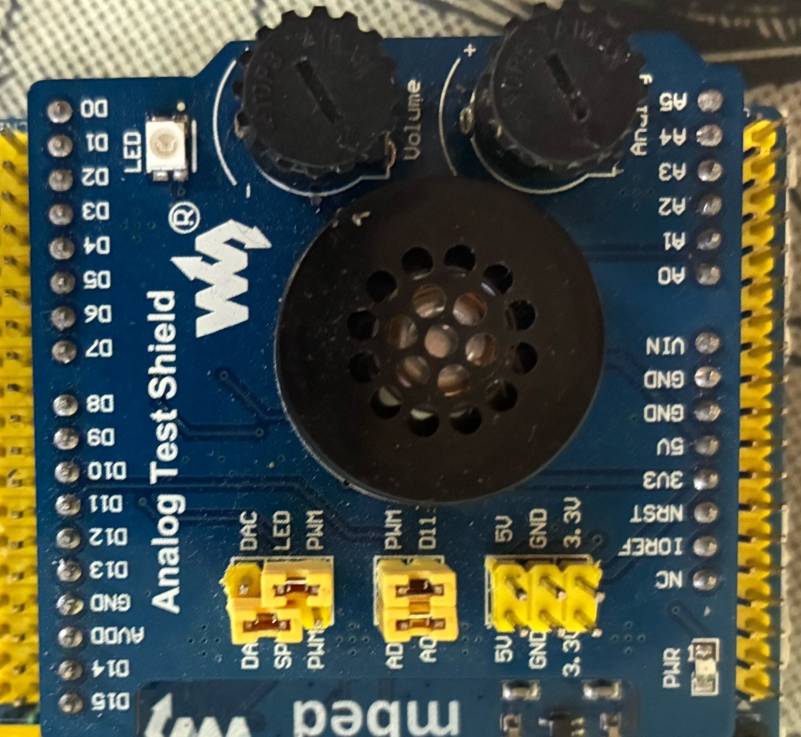

=== Интерфейс USART2

==== Выбор USART2

В проекте используется модуль **USART2** по следующим причинам:

1. **Аппаратная связь с USB** — на отладочной плате XNUCLEO-F411RE USART2 аппаратно подключён к преобразователю интерфейсов CP2102, который выведен на microUSB-разъём. Это позволяет выводить отладочную информацию на компьютер без дополнительных адаптеров.

2. **Подключение Bluetooth-модуля** — на плате расширения Accessory Shield Bluetooth-модуль HC-06 подключён именно к выводам USART2 (PA2 — TX, PA3 — RX). Это стандартное соединение для данного шилда.

3. **Независимость от отладчика** — в отличие от USART1, который часто используется для отладки через ST-Link, USART2 остаётся свободным для прикладных задач.

==== Настройка скорости передачи и передискретизация

USART2 тактируется от системной частоты 16 МГц. Для получения скорости 9600 бод необходимо правильно настроить регистр `BRR` (Baud Rate Register).

Формула расчёта делителя:

[stem]
++++
USARTDIV = \frac{f_{CK}}{8 \cdot (2 - OVER8) \cdot BaudRate}
++++

где:
* `f_{CK} = 16 000 000` Гц — частота тактирования USART2;
* `OVER8` — коэффициент передискретизации (0 — 16-кратная, 1 — 8-кратная);
* `BaudRate = 9600` — требуемая скорость.

В данном проекте выбран режим **16-кратной передискретизации** (`OVER8 = 0`), так как он обеспечивает лучшую помехоустойчивость за счёт усреднения 16 отсчётов на бит.

Подставляя значения:

[stem]
++++
USARTDIV = \frac{16 000 000}{8 \cdot 2 \cdot 9600} = \frac{16 000 000}{153 600} \approx 104,1667
++++

Из полученного значения необходимо вычесть 1 (согласно документации на STM32, регистр BRR хранит значение USARTDIV − 1):

[stem]
++++
USARTDIV_{reg} = USARTDIV - 1 = 104,1667 - 1 = 103,1667
++++

==== Целая и дробная части делителя

Регистр `BRR` имеет специальный формат: биты `15:4` содержат целую часть (Mantissa), а биты `3:0` — дробную часть (Fraction). Дробная часть хранит значение `DIV_Fraction = 16 × (USARTDIV - DIV_Mantissa)`.

Для `USARTDIV_reg = 103,1667`:
* `DIV_Mantissa = 103` (целая часть).
* `USARTDIV_reg - DIV_Mantissa = 0,1667`.
* `DIV_Fraction = 16 × 0,1667 = 2,667`.

Округляем до ближайшего целого: `DIV_Fraction = 3`.

Таким образом, в регистр `BRR` записывается значение: `BRR = (103 << 4) | 3 = 1651`.

Использование дробной части позволяет более точно настроить скорость передачи, минимизируя ошибку тактирования. Без дробной части пришлось бы использовать `DIV_Mantissa = 103`, что дало бы реальную скорость:

[stem]
++++
Baud_{реал} = \frac{16 000 000}{8 \cdot 2 \cdot 103} \approx 9709 \text{ бод}
++++

Ошибка составила бы около 1,1%, что ещё допустимо, но с дробной частью ошибка снижается до 0,006%.

==== Что такое передискретизация

Передискретизация (oversampling) — это метод, при котором каждый бит данных измеряется несколько раз (16 или 8 раз), а затем принимается решение о значении бита (0 или 1) по большинству отсчётов.

* **16-кратная передискретизация** (`OVER8 = 0`) — каждый бит опрашивается 16 раз. Это даёт лучшую помехоустойчивость и устойчивость к дребезгу фронтов, но требует более высокой тактовой частоты (до `f_{CK} / 8`).
* **8-кратная передискретизация** (`OVER8 = 1`) — каждый бит опрашивается 8 раз. Позволяет достичь вдвое большей скорости передачи (до `f_{CK} / 4`), но хуже подавляет шумы.

В проекте выбрана 16-кратная передискретизация, так как скорость 9600 бод не требует максимальной частоты, а устойчивость к помехам важна для Bluetooth-соединения.

=== Математическая модель устройства

Математическая модель описывает полный тракт преобразования входного аналогового напряжения в выходные цифровые сигналы: количество горящих светодиодов и Bluetooth-сообщение. Модель состоит из пяти последовательных этапов.

.Графическое представление математической модели устройства
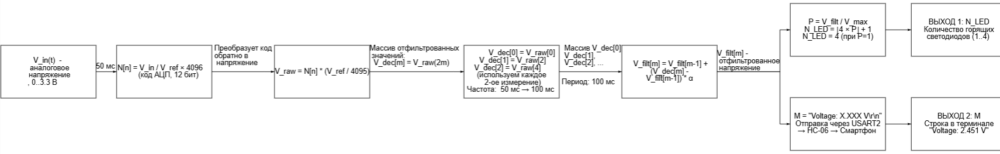

==== Этап 1: Аналого-цифровое преобразование (АЦП)

На данном этапе аналоговое напряжение stem:[V_{in}(t)], формируемое переменным резистором (диапазон 0..3,3 В), поступает на вход АЦП микроконтроллера (вывод PA0). Встроенный 12-битный АЦП преобразует это напряжение в цифровой код по формуле:

[stem]
++++
N[n] = \frac{V_{in}}{V_{ref}} \cdot 4096
++++

где:
* stem:[N[n]] — цифровой код АЦП (целое число от 0 до 4095);
* stem:[V_{ref} = 3.3 \text{ В}] — опорное напряжение АЦП;
* stem:[n = 0, 1, 2, \dots] — номер измерения;
* период измерений составляет 50 мс.

Полученный цифровой код автоматически переносится в память микроконтроллера с помощью DMA, без участия процессора. Затем выполняется калибровка для компенсации систематических погрешностей:

[stem]
++++
V_{raw}[n] = K \cdot N[n] \cdot \frac{V_{ref}}{4096} + B
++++

где stem:[K] — калибровочный коэффициент усиления (в идеале ~1.0), stem:[B] — калибровочное напряжение смещения (в идеале ~0.0 В).

==== Этап 2: Децимация (прореживание)

Исходные измерения выполняются с периодом 50 мс, однако цифровой фильтр рассчитан на шаг stem:[dt = 100 \text{ мс}]. Для согласования этих значений применяется децимация (прореживание) — из потока измерений выбирается каждое второе значение:

[stem]
++++
V_{dec}[m] = V_{raw}[2m], \quad m = 0, 1, 2, \dots
++++

где:
* stem:[V_{dec}[m\]] — прореженный массив значений с эффективным периодом 100 мс;
* stem:[V_{raw}[2m\]] — каждое второе измерение из исходного потока.

Таким образом, частота данных снижается с 20 Гц до 10 Гц, что соответствует периоду работы цифрового фильтра.

==== Этап 3: Цифровая фильтрация (ФНЧ 1-го порядка)

К прореженным данным применяется цифровой фильтр нижних частот первого порядка (экспоненциальное сглаживание). Коэффициент фильтра вычисляется по формуле:

[stem]
++++
\tau = \begin{cases}
1 - e^{-dt / RC}, & \text{если } RC > 0 \\
1, & \text{если } RC \leq 0
\end{cases}
++++

где:
* stem:[dt = 100 \text{ мс}] — период фильтрации;
* stem:[RC] — постоянная времени фильтра (задаётся в конфигурации, например stem:[RC = 0.5 \text{ с}]);
* stem:[\tau \approx 0.181] при stem:[RC = 0.5 \text{ с}].

Разностное уравнение фильтра:

[stem]
++++
V_{filt}[m] = V_{filt}[m-1] + (V_{dec}[m] - V_{filt}[m-1]) \cdot \tau
++++

с начальным условием: stem:[V_{filt}[0\] = V_{dec}[0\]].

Фильтр сглаживает случайные шумы и пульсации, обеспечивая устойчивость показаний. Большее значение stem:[RC] даёт более сильное сглаживание, но увеличивает время реакции на изменение напряжения.

==== Этап 4: Индикация на светодиодах

Отфильтрованное напряжение stem:[V_{filt}[m\]] нормируется относительно максимального напряжения stem:[V_{max} = 3.3 \text{ В}]:

[stem]
++++
P[m] = \frac{V_{filt}[m]}{V_{max}}, \quad P \in [0, 1]
++++

Количество включаемых светодиодов определяется по кусочно-постоянной функции:

[stem]
++++
N_{LED}[m] = \begin{cases}
1, \text{если } 0.00 \leq P < 0.25 \\
2, \text{если } 0.25 \leq P < 0.50 \\
3, \text{если } 0.50 \leq P < 0.75 \\
4, \text{если } 0.75 \leq P \leq 1.00
\end{cases}
++++

В аналитической форме (для stem:[P \in [0, 1)]):

[stem]
++++
N_{LED} = \lfloor 4 \cdot P \rfloor + 1
++++

Состояние каждого светодиода (1 — горит, 0 — не горит):

[stem]
++++
LED_i[m] = \begin{cases}
1, \text{если } i \leq N_{LED}[m] \\
0, \text{если } i > N_{LED}[m]
\end{cases}, \quad i = 1, 2, 3, 4
++++

==== Этап 5: Формирование и отправка Bluetooth-сообщения

С периодом 1 секунда отфильтрованное значение напряжения преобразуется в текстовую строку фиксированного формата и отправляется по Bluetooth:

[stem]
++++
M[k] = \text{"Voltage: "} + \text{Format}(V_{filt}[k \cdot 10], \text{"\%.3f"}) + \text{" V\textbackslash r\textbackslash n"}
++++

где stem:[k = 0, 1, 2, \dots] — номер Bluetooth-сообщения (каждые 1000 мс = 10 шагов фильтрации).

Маршрут передачи данных:
. Строка формируется в задаче `BluetoothTask`
. Передаётся посимвольно через интерфейс USART2 (вывод PA2 — TX)
. Поступает на вход RX Bluetooth-модуля HC-06
. Модуль HC-06 передаёт данные по радиоканалу Bluetooth (профиль SPP)
. Смартфон или ПК принимает данные и отображает в терминальном приложении

==== Параметры модели

Основные числовые параметры, используемые в модели, сведены в таблицу ниже.

.Параметры математической модели
[cols="1,2,1"]
|===
|Параметр |Значение |Единицы измерения

|stem:[V_{ref}]
|3.3
|В

|stem:[V_{max}]
|3.3
|В

|stem:[T_s] (период АЦП)
|50
|мс

|stem:[T_f] (период фильтрации, stem:[dt])
|100
|мс

|stem:[T_{bt}] (период Bluetooth)
|1000
|мс

|stem:[RC] (пост. времени фильтра)
|0.5
|с

|stem:[\tau] (коэфф. фильтра)
|~0.181
|безразм.

|stem:[K] (калибр. коэфф.)
|~1.0
|безразм.

|stem:[B] (калибр. смещение)
|~0.0
|В
|===

=== Беспроводной интерфейс

Передача данных на смартфон или ПК осуществляется через Bluetooth-модуль *HC-06*, работающий как прозрачный мост UART–Bluetooth (SPP-профиль). Модуль HC-06 подключается к USART2 микроконтроллера (PA2 — TX, PA3 — RX). Он работает в режиме «прозрачного моста»: всё, что отправляется в USART2, передаётся по Bluetooth на подключённое устройство (смартфон, ПК).

Настройки модуля по умолчанию:
* Скорость: 9600 бод
* 8 бит данных
* 1 стоп-бит
* Без контроля чётности

Для передачи строки напряжения используется функция `SendMessage()`, которая отправляет строку посимвольно, ожидая готовности передатчика (флаг `TXE` в регистре `SR`).

.Bluetooth-модуль HC-06
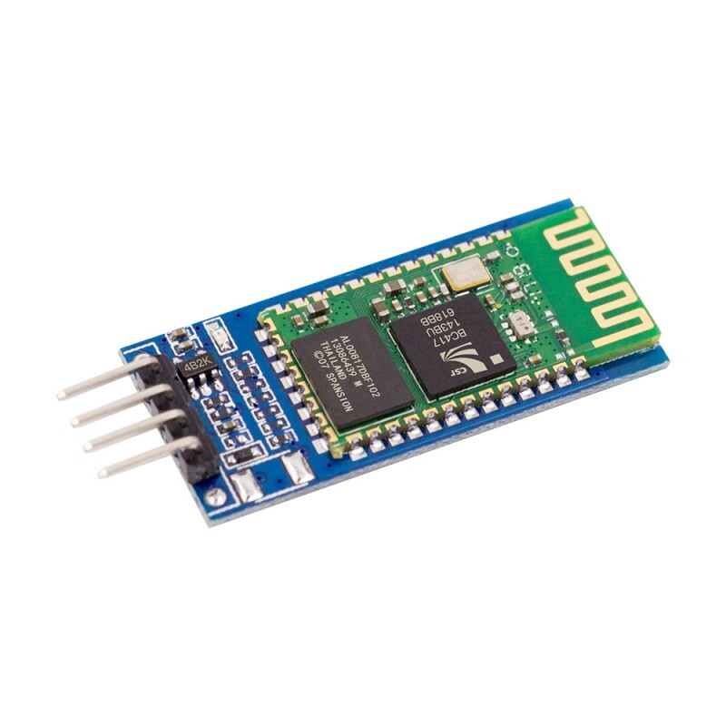

Подключение Bluetooth-модуля HC-06 к XNUCLEO-F411RE
Для передачи данных на смартфон или ПК используется Bluetooth-модуль HC-06. Подключение модуля к отладочной плате осуществляется в соответствии с таблицей 3.

.Подключение HC-06 к XNUCLEO-F411RE
[cols="1,1,1"]
|===
|Вывод HC-06 |Вывод XNUCLEO-F411RE |Назначение

|VCC
|3.3V 
|Питание модуля (только 3.3 В!)

|GND
|GND 
|Общий провод

|TX
|PA3 (USART2 RX)
|Передача данных от модуля к плате

|RX
|PA2 (USART2 TX)
|Приём данных от платы к модулю
|===

.Подключение hc-06 к плате
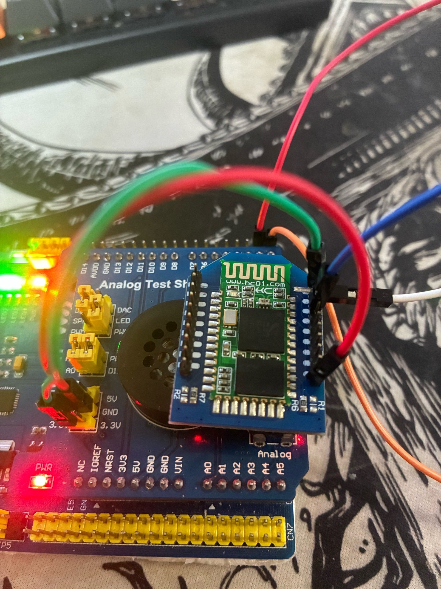

Настройка Bluetooth-соединения со смартфоном
После правильного подключения модуля HC-06 необходимо выполнить сопряжение со смартфоном:

Подать питание на плату — на HC-06 замигает светодиод (частое мигание означает ожидание подключения).

Включить Bluetooth на смартфоне.

Найти устройство — в списке доступных устройств появится HC-06.

Выполнить сопряжение — пароль 1234.

Запустить терминальное приложение (например, Serial Bluetooth Terminal).

Подключиться к HC-06.
video::VideoIndication.mp4[opts="muted"]

После успешного подключения светодиод на HC-06 начнёт мигать редко или будет гореть постоянно, что свидетельствует об установленном соединении.

== Программная архитектура

Архитектура построена на принципах вытесняющей многозадачности с использованием ОСРВ FreeRTOS и обёртки `RtosWrapper`.

.Структурная схема
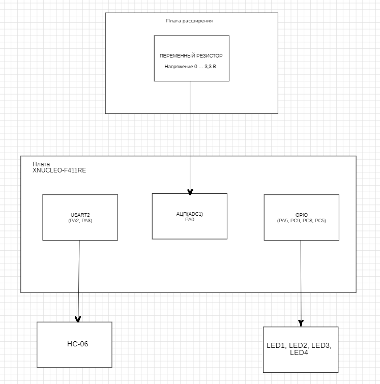

Система разделена на три уровня:

1. **Аппаратный уровень** — STM32F411RE, АЦП, DMA, GPIO, USART2, HC-06, светодиоды.
2. **Уровень ОСРВ** — планировщик FreeRTOS, очереди сообщений.
3. **Прикладной уровень**:
   * `MeasurementTask` (период 100 мс) — запуск АЦП, чтение кода через DMA, фильтрация, индикация.
   * `BluetoothTask` (период 1 с) — отправка строки `"Voltage: X.XXX V"` через USART2.

== Архитектура

Архитектура построена на принципах вытесняющей многозадачности с использованием ОСРВ FreeRTOS.

.Общая архитектура
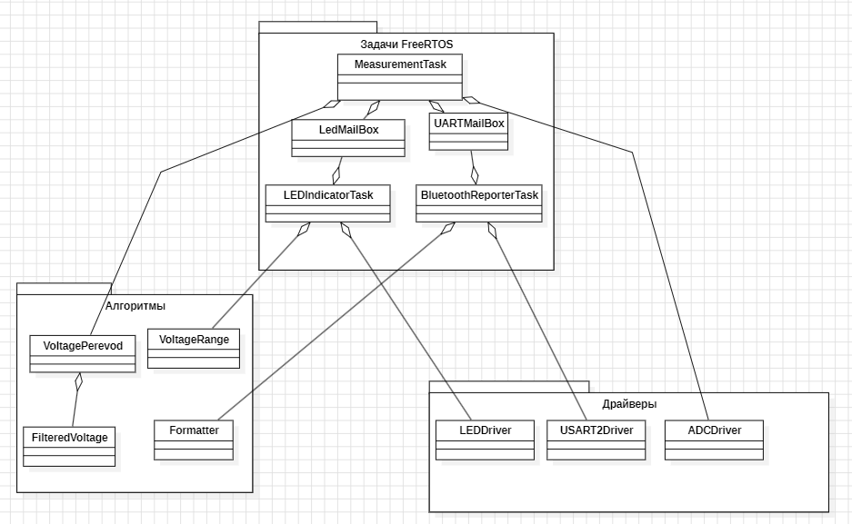

Главная задача MeasurementTask запускает измерение каждые 50 мс. АЦП выдает сырое напряжение в виде кода отправляет в VoltagePerevod. Тот переводит его в напряжение и отправляет дальше в FilteredVoltage. FilteredVoltage, в свою очередь, кладет отфильтрованное значение в LedMailBox и UARTMailBox. Дальше VoltageRange считывает проценты напряжения ,а LEDDriver уже переводит эти проценты в необходимое количество включенных светодиодов. После полученного напряжения UartMailBox передает его в BluetoothReporterTask и отправляет строку, переведенную через форматор в USART2Driver.

=== ADCDriver

**Назначение:** Драйвер АЦП (Analog-to-Digital Converter)

**Что делает:**
- Инициализирует ADC1 для измерения напряжения на входе PA0
- Настраивает DMA2 для автоматической передачи данных
- Возвращает сырой цифровой код (0-4095) с АЦП

**Методы:**
- `Init()` - настройка ADC, DMA, GPIO
- `GetValue()` - возвращает сырой код АЦП (0-4095)

.ADCDriver
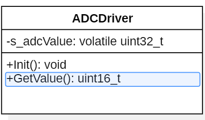

---

=== VoltagePerevod

**Назначение:** Преобразование сырого кода АЦП в напряжение

**Что делает:**
- Принимает сырой код (0-4095) от ADCDriver
- Преобразует в напряжение по формуле: `code * 3.3 / 4095`
- Возвращает напряжение в вольтах (0-3.3V)

**Методы:**
- `Convert(adcCode)` - преобразование кода в напряжение

.VoltagePerevod
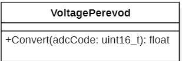

---

=== FilteredVoltage

**Назначение:** Фильтр нижних частот для сглаживания сигнала

**Что делает:**
- Принимает сырое напряжение с АЦП
- Сглаживает шумы и выбросы через цифровой RC-фильтр
- Возвращает стабильное отфильтрованное значение

**Методы:**
- `FilteredVoltage(tau)` - конструктор, инициализация фильтра
- `Update(rawVoltage)` - обновление фильтра новым значением
- `GetValue()` - получение отфильтрованного напряжения
- `Reset()` - сброс фильтра в начальное состояние

**Формула фильтра:** `filtered = filtered + (raw - filtered) * tau`

.FilteredVoltage
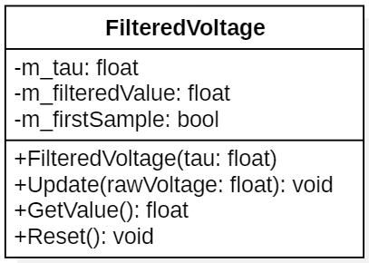

---

=== VoltageRange (enum)

**Назначение:** Перечисление уровней напряжения

**Значения:**
- `LEVEL_0` - 0-25% напряжения (1 LED)
- `LEVEL_1` - 25-50% напряжения (2 LED)
- `LEVEL_2` - 50-75% напряжения (3 LED)
- `LEVEL_3` - 75-100% напряжения (4 LED)

.VoltageRange
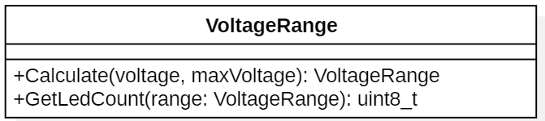

---

=== LEDDriver

**Назначение:** Драйвер светодиодной линейки (4 LED)

**Что делает:**
- Инициализирует GPIO пины для 4 светодиодов (PA5, PC9, PC8, PC5)
- Управляет включением/выключением каждого светодиода
- Включает нужное количество светодиодов в зависимости от уровня напряжения

**Схема светодиодов:**
- LED1 (PA5) - горит при 0-25% напряжения
- LED2 (PC9) - горит при 25-50%
- LED3 (PC8) - горит при 50-75%
- LED4 (PC5) - горит при 75-100%

**Методы:**
- `Init()` - настройка GPIO пинов как выходов
- `SetLED(index, state)` - включить/выключить конкретный LED
- `SetAll(state)` - управление всеми LED сразу
- `SetCount(count)` - включить count LED (1-4)

.LEDDriver
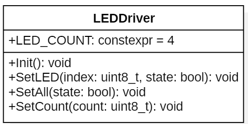

---

=== Formatter

**Назначение:** Форматирование строк для отправки по Bluetooth

**Что делает:**
- Преобразует число (напряжение) в строку
- Форматирует строку по шаблону "Voltage: X.XXX V\r\n"
- Подготавливает данные для отправки через UART

**Методы:**
- `Format(voltage, buffer, bufferSize)` - форматирование строки

.Formator
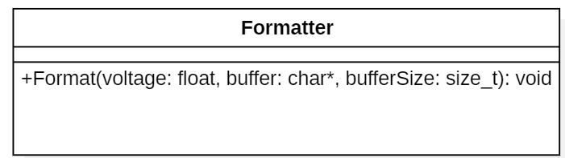

---

=== USART2Driver

**Назначение:** Драйвер UART для Bluetooth модуля HC-06

**Что делает:**
- Инициализирует USART2 на пинах PA2 (TX) и PA3 (RX)
- Отправляет данные по последовательному интерфейсу
- Передаёт отформатированное напряжение на Bluetooth модуль

**Методы:**
- `Init(baudrate)` - настройка UART, GPIO, скорости 9600
- `SendChar(c)` - отправка одного символа
- `SendString(str)` - отправка строки

.USART2Driver
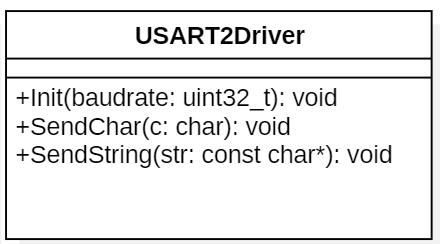

---

=== MeasurementTask

**Назначение:** Главная задача измерения напряжения (приоритет 2)

**Что делает:**
- Ожидает сигнал от таймера TIM2 каждые 50 мс
- Читает сырой код с АЦП через ADCDriver
- Преобразует код в напряжение через VoltagePerevod
- Фильтрует напряжение через FilteredVoltage
- Отправляет отфильтрованное значение в очереди для других задач

**Атрибуты:**
- `m_filter` - объект фильтра FilteredVoltage
- `m_lastRawVoltage` - последнее сырое напряжение
- `m_lastFilteredVoltage` - последнее отфильтрованное напряжение
- `s_ledMailBox` - очередь для LEDIndicatorTask
- `s_uartMailBox` - очередь для BluetoothReporterTask

**Методы:**
- `MeasurementTask()` - конструктор
- `Execute()` - основной цикл задачи
- `ProcessVoltage(rawVoltage)` - применение фильтра
- `InitTimer()` - инициализация таймера TIM2

.MeasurementTask
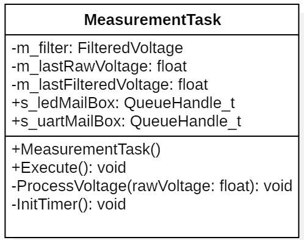

---

=== LEDIndicatorTask

**Назначение:** Задача управления светодиодами (приоритет 1)

**Что делает:**
- Ожидает новые данные из очереди s_ledMailBox
- Получает отфильтрованное напряжение
- Вычисляет уровень через VoltageRangeCalculator
- Включает нужное количество светодиодов через LEDDriver

**Методы:**
- `Execute()` - основной цикл задачи
- `UpdateLEDs(voltage)` - обновление светодиодов

.LEDIndicatorTask
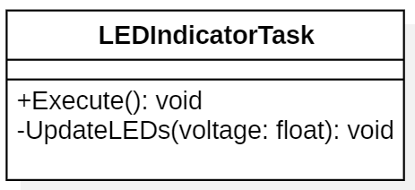

---

=== BluetoothReporterTask

**Назначение:** Задача отправки данных по Bluetooth (приоритет 0)

**Что делает:**
- Ожидает новые данные из очереди s_uartMailBox
- Получает отфильтрованное напряжение
- Форматирует строку через Formator
- Отправляет строку через USART2Driver на модуль HC-06

**Методы:**
- `Execute()` - основной цикл задачи
- `ReportVoltage(voltage)` - форматирование и отправка

.BluetoothReporterTask
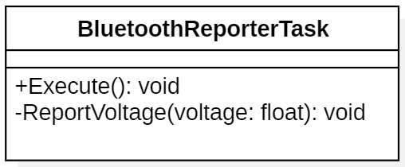

---

=== LedMailBox (очередь)

**Тип:** `QueueHandle_t` (статическая переменная в MeasurementTask)

**Назначение:** передача отфильтрованного напряжения из MeasurementTask в LEDIndicatorTask

**Параметры:**
- Размер очереди: 10 элементов
- Тип данных: `float`

**Операции:**
- `xQueueCreate(10, sizeof(float))` - создание
- `xQueueSend(s_ledMailBox, &value, 0)` - отправка
- `xQueueReceive(s_ledMailBox, &value, portMAX_DELAY)` - получение

.LedMailBox
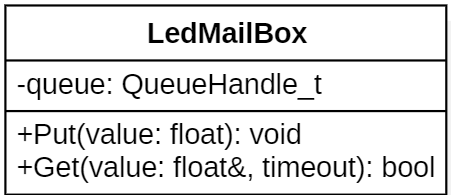

---

=== UARTMailBox (очередь)

**Тип:** `QueueHandle_t` (статическая переменная в MeasurementTask)

**Назначение:** передача отфильтрованного напряжения из MeasurementTask в BluetoothReporterTask

**Параметры:**
- Размер очереди: 10 элементов
- Тип данных: `float`

**Операции:**
- `xQueueCreate(10, sizeof(float))` - создание
- `xQueueSend(s_uartMailBox, &value, 0)` - отправка
- `xQueueReceive(s_uartMailBox, &value, pdMS_TO_TICKS(100))` - получение

.UARTMailBox
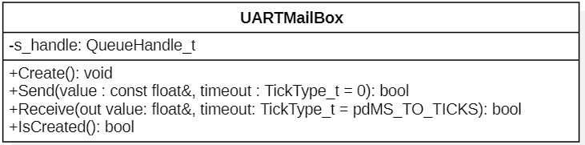

== Настройка периферийных регистров

В данном разделе подробно рассматривается конфигурация регистров микроконтроллера STM32F411RE, используемых в проекте. Каждый регистр и каждый бит сопровождается пояснением: почему выбрано именно такое значение и как это влияет на работу устройства.

=== Тактирование (RCC)

==== Выбор источника тактовой частоты

В проекте используется внутренний генератор HSI (High-Speed Internal) на частоту 16 МГц. Это решение принято по следующим причинам:

1. **Независимость от внешних компонентов** — HSI работает без подключения внешнего кварцевого резонатора, что упрощает схему и снижает стоимость.
2. **Быстрый запуск** — HSI готов к работе за несколько микросекунд после подачи питания, в то время как внешний генератор (HSE) требует времени на стабилизацию (миллисекунды).
3. **Достаточная точность** — для работы АЦП, DMA и USART2 на скорости 9600 бод точности HSI (±1% после калибровки) вполне достаточно.
4. **Энергопотребление** — HSI потребляет меньше тока, чем внешний кварцевый генератор.

==== Регистр RCC→CR (Control Register)

Регистр управления тактовым генератором. Позволяет включать/выключать различные источники тактовой частоты и проверять их готовность.

*Регистр RCC→CR*
[cols="1,1,1,4"]
|===
|Бит |Имя |Значение |Назначение и пояснение
|16 |HSION |1 |**HSI On** — включение внутреннего высокоскоростного генератора на 16 МГц. Без этого бита микроконтроллер не будет работать на полной скорости.
|17 |HSIRDY |(чтение) |**HSI Ready** — флаг готовности HSI. Устанавливается аппаратно, когда генератор стабилизируется. В коде мы ожидаем сброса этого флага (NotReady), затем дожидаемся его установки. Это гарантирует, что HSI действительно запустился.
|===

==== Регистр RCC→CFGR (Clock Configuration Register)

Регистр конфигурации тактовой частоты. Определяет, какой источник тактового сигнала используется в качестве системной частоты.

*Регистр RCC→CFGR*
[cols="1,1,1,4"]
|===
|Биты |Имя |Значение |Назначение и пояснение
|0–1 |SW |0b01 (HSI) |**System clock Switch** — выбор системной тактовой частоты. Значение 0b01 означает, что системный тактовый сигнал берётся с HSI (16 МГц).
|2–3 |SWS |(чтение) |**System clock Switch Status** — статус переключения. Чтением этих битов мы подтверждаем, что переключение на HSI действительно произошло. Должно быть значение 0b01.
|===

==== Регистры RCC→AHB1ENR, RCC→APB2ENR, RCC→APB1ENR

Эти регистры включают тактирование отдельных периферийных модулей. **Важно:** в микроконтроллерах STM32 тактирование на большинство периферийных блоков изначально отключено для экономии энергии. Перед использованием любого модуля (GPIO, ADC, DMA, USART) необходимо включить его тактирование.

*Регистры включения тактирования периферии*
[cols="1,1,1,1,4"]
|===
|Регистр |Бит |Имя |Значение |Назначение и пояснение
|AHB1ENR |0 |GPIOAEN |1 |**GPIOA Enable** — включает тактирование порта ввода-вывода A. Без этого бита нельзя читать или писать в регистры GPIOA.
|AHB1ENR |2 |GPIOCEN |1 |**GPIOC Enable** — включает тактирование порта C (светодиоды LED2, LED3, LED4).
|AHB1ENR |22 |DMA2EN |1 |**DMA2 Enable** — включает тактирование контроллера прямого доступа к памяти DMA2. DMA — это отдельный блок, которому нужен тактовый сигнал.
|APB2ENR |8 |ADC1EN |1 |**ADC1 Enable** — включает тактирование АЦП1. АЦП подключён к шине APB2.
|APB2ENR |0 |SYSCFGEN |1 |**System Configuration Enable** — включает тактирование системной конфигурации (необходимо для настройки внешних прерываний и некоторых других функций).
|APB1ENR |17 |USART2EN |1 |**USART2 Enable** — включает тактирование USART2. USART2 подключён к шине APB1.
|===

=== Порты ввода-вывода (GPIO)

GPIO (General Purpose Input/Output) — универсальные порты ввода-вывода. Каждый вывод может работать в одном из режимов: вход, выход, альтернативная функция, аналоговый вход.

==== Регистры режима работы (MODER)

Регистр MODER (Mode Register) определяет режим работы каждого вывода (2 бита на вывод).

*Порт A (GPIOA)*
[cols="1,1,1,4"]
|===
|Вывод |Регистр |Значение |Назначение и пояснение
|PA0 |MODER0 |0b11 (Analog) |**Аналоговый режим** — вывод подключается напрямую к АЦП. В этом режиме отключаются цифровые буферы, что уменьшает шумы при аналоговом измерении.
|PA5 |MODER5 |0b01 (Output) |**Цифровой выход** — управление светодиодом LED1 (0–25%).
|PA2 |MODER2 |0b10 (Alternate) |**Альтернативная функция** — вывод управляется не напрямую из кода, а встроенным периферийным модулем (USART2 TX).
|PA3 |MODER3 |0b10 (Alternate) |**Альтернативная функция** — вывод управляется модулем USART2 (RX).
|===

*Порт C (GPIOC)*
[cols="1,1,1,4"]
|===
|Вывод |Регистр |Значение |Назначение и пояснение
|PC9 |MODER9 |0b01 (Output) |**Цифровой выход** — управление светодиодом LED2 (25–50%).
|PC8 |MODER8 |0b01 (Output) |**Цифровой выход** — управление светодиодом LED3 (50–75%).
|PC5 |MODER5 |0b01 (Output) |**Цифровой выход** — управление светодиодом LED4 (75–100%).
|===

==== Регистры альтернативных функций (AFRL/AFRH)

Когда вывод работает в режиме альтернативной функции, необходимо указать, какой именно периферийный модуль будет им управлять. Для каждого вывода можно выбрать до 16 различных функций.

*Регистр AFRL (Alternate Function Low) для PA0-PA7*
[cols="1,1,1,4"]
|===
|Вывод |Регистр |Значение |Назначение и пояснение
|PA2 |AFRL2 |0b0111 (AF7) |**Alternate Function 7** — для PA2 альтернативная функция 7 соответствует USART2_TX (передача данных).
|PA3 |AFRL3 |0b0111 (AF7) |**Alternate Function 7** — для PA3 альтернативная функция 7 соответствует USART2_RX (приём данных).
|===

==== Регистры подтяжки (PUPDR)

Регистр PUPDR (Pull-Up / Pull-Down Register) включает внутренние резисторы подтяжки к питанию или к земле. Это нужно для обеспечения определённого уровня на выводе, когда внешний сигнал отсутствует или находится в высокоимпедансном состоянии.

*Регистр PUPDR для порта A*
[cols="1,1,1,4"]
|===
|Вывод |Регистр |Значение |Назначение и пояснение
|PA2 |PUPDR2 |0b00 |**Без подтяжки** — вывод TX работает как выход, подтяжка не нужна, так как уровень задаётся передатчиком USART.
|PA3 |PUPDR3 |0b01 |**Подтяжка вверх (Pull-Up)** — вывод RX работает как вход. Подтяжка к 3,3 В через внутренний резистор (~40 кОм) обеспечивает логическую 1, когда линия свободна (нет передачи). Это предотвращает ложные срабатывания от шумов.
|===

==== Регистры управления выходами (ODR)

ODR (Output Data Register) — регистр выходных данных. Запись 1 в соответствующий бит устанавливает на выводе высокий уровень (3,3 В), запись 0 — низкий уровень (0 В).

*Управление светодиодами через ODR*
[cols="1,1,3,4"]
|===
|Регистр |Бит |Назначение |Пояснение
|GPIOA→ODR |5 |LED1 |Запись 1 — LED1 горит, запись 0 — LED1 потушен.
|GPIOC→ODR |9 |LED2 |Аналогично для LED2.
|GPIOC→ODR |8 |LED3 |Аналогично для LED3.
|GPIOC→ODR |5 |LED4 |Аналогично для LED4.
|===

=== АЦП (ADC1)

АЦП (Analog-to-Digital Converter) преобразует аналоговое напряжение в цифровой код. В проекте АЦП используется в режиме одиночного преобразования с программным запуском по таймеру. Измерения выполняются с периодом 50 мс. После каждого преобразования 12-битный код автоматически переносится в память через DMA в циркулярном режиме, что освобождает процессор от необходимости опрашивать флаги готовности АЦП. Процессор в это время выполняет цифровую фильтрацию, управляет светодиодной индикацией и отправляет данные по USART2.

==== Регистр ADC1→CR1 (Control Register 1)

*Регистр ADC1→CR1*
[cols="1,1,1,4"]
|===
|Бит(ы) |Имя |Значение |Назначение и пояснение
|24 |SCAN |1 |**Scan mode** — режим сканирования. При использовании нескольких каналов АЦП будет последовательно опрашивать их все. У нас один канал, но режим включён для универсальности.
|3–2 |RES |0b11 |**Resolution** — разрядность преобразования. 0b11 означает 12 бит (максимальная точность). Другие варианты: 0b00 — 6 бит, 0b01 — 8 бит, 0b10 — 10 бит.
|===

==== Регистр ADC1→CR2 (Control Register 2)

*Регистр ADC1→CR2*
[cols="1,1,1,4"]
|===
|Бит |Имя |Значение |Назначение и пояснение
|1 |CONT |0 |**Continuous conversion** — непрерывное преобразование. Значение 0 означает одиночный режим: после запуска АЦП выполняет одно преобразование и останавливается. Это удобно, когда период задаётся таймером или задержкой в задаче ОСРВ.
|8 |DMA |1 |**DMA enable** — разрешает использование DMA для чтения данных АЦП. Без этого бита данные пришлось бы читать программно через регистр DR.
|9 |DDS |1 |**DMA disable selection** — при значении 1 DMA-запрос генерируется при каждом новом преобразовании. Это гарантирует, что каждое измерение будет сохранено в память.
|0 |ADON |1 |**ADC ON** — включает АЦП. Без этого бита АЦП не потребляет ток и не работает.
|30 |SWSTART |1 |**Software start** — программный запуск преобразования. При записи 1 запускается новое измерение. После завершения бит сбрасывается аппаратно.
|===

=== DMA2 (контроллер прямого доступа к памяти)

DMA (Direct Memory Access) позволяет пересылать данные между периферией и памятью без участия процессора.

==== Что такое двойной буфер (DBM) и почему он отключён

**Двойной буфер (Double Buffer Mode)** — режим, при котором DMA использует два адреса памяти: один для текущей передачи, другой — для следующей. Когда текущий буфер заполняется, DMA автоматически переключается на второй, а первый становится доступным для обработки процессором. Это позволяет обрабатывать данные без остановки DMA.

В данном проекте **двойной буфер отключён** (`DBM = 0`), потому что:
1. Мы передаём только одно значение (код АЦП) за один раз.
2. Нет необходимости в двух буферах, так как процессор успевает обработать значение до следующего измерения.
3. Отключение двойного буфера упрощает конфигурацию и экономит память.

==== Регистр DMA2→S0CR (Stream 0 Configuration Register)

*Регистр DMA2→S0CR (Stream 0)*
[cols="1,1,1,4"]
|===
|Бит(ы) |Имя |Значение |Назначение и пояснение
|0 |EN |0→1 |**Enable** — включение DMA. Перед настройкой сбрасываем (0), после настройки устанавливаем (1). Это стандартная практика для безопасной конфигурации.
|25–23 |CHSEL |0b000 |**Channel selection** — выбор канала DMA. Канал 0 соответствует запросам от ADC1. Каждый канал связан с определённой периферией.
|19 |CT |0 |**Current target** — выбор текущего целевого буфера при двойном буфере. Так как двойной буфер отключён, используется S0M0AR.
|22 |DBM |0 |**Double buffer mode** — режим двойного буфера. **Отключён**, так как передаём одно значение. При включении (1) DMA переключается между S0M0AR и S0M1AR.
|13–11 |MSIZE |0b10 |**Memory size** — размер данных в памяти. 0b10 = 32 бита (слово). Это соответствует размеру переменной `data`.
|10–8 |PSIZE |0b10 |**Peripheral size** — размер данных в периферии. 0b10 = 32 бита (слово). Регистр данных АЦП (ADC1::DR) имеет размер 32 бита.
|8 |CIRC |1 |**Circular mode** — циркулярный режим. После завершения передачи DMA автоматически перезапускается, сбрасывая счётчик NDTR. Это позволяет бесконечно передавать данные без перезапуска DMA.
|6–4 |DIR |0b00 |**Direction** — направление передачи. 0b00 означает «из периферии в память» (Peripheral-to-memory). Нам нужно читать данные из АЦП и сохранять в ОЗУ.
|5 |PFCTRL |0 |**Peripheral flow controller** — управление потоком от периферии. 0 означает, что DMA контролирует передачу (стандартный режим).
|===

==== Регистры адресов и счётчика

*Регистр DMA2→S0PAR* (Peripheral Address Register)
[cols="1,1,4"]
|===
|Поле |Значение |Назначение и пояснение
|PAR |`ADC1::DR::Address` |**Peripheral address** — адрес регистра данных АЦП. Отсюда DMA будет читать данные.
|===

*Регистр DMA2→S0M0AR* (Memory 0 Address Register)
[cols="1,1,4"]
|===
|Поле |Значение |Назначение и пояснение
|M0A |`&adcData` |**Memory address** — адрес переменной `adcData` в ОЗУ. Сюда DMA будет записывать данные.
|===

*Регистр DMA2→S0NDTR* (Number of Data to Transfer Register)
[cols="1,1,4"]
|===
|Поле |Значение |Назначение и пояснение
|NDT |1 |**Number of data items** — количество элементов для передачи. Так как мы передаём одно значение (код АЦП) за одно преобразование, устанавливаем 1.
|===

=== USART2

USART (Universal Synchronous Asynchronous Receiver Transmitter) — универсальный синхронно-асинхронный приёмопередатчик. В проекте используется в асинхронном режиме (UART) для связи с Bluetooth-модулем.

==== Что такое приёмник (RE) и передатчик (TE)

* **Передатчик (TE — Transmitter Enable)** — когда этот бит установлен, USART может передавать данные. Передача начинается при записи байта в регистр DR. Данные отправляются последовательно бит за битом через вывод TX.

В проекте включен: передатчик для отправки данных на Bluetooth.

==== Что такое контроль чётности (PCE) и почему он отключён

**Контроль чётности (Parity Check)** — механизм обнаружения ошибок при передаче данных. Перед отправкой каждого байта вычисляется количество единиц в данных. В зависимости от настройки (чётность или нечётность) добавляется дополнительный бит (бит чётности). Приёмник проверяет совпадение и может обнаружить одиночную ошибку.

* **Чётность (Even)** — бит чётности устанавливается так, чтобы общее количество единиц (включая бит чётности) было чётным.
* **Нечётность (Odd)** — общее количество единиц должно быть нечётным.

В проекте **контроль чётности отключён** (`PCE = 0`), потому что:
1. Bluetooth-модуль HC-06 по умолчанию работает без контроля чётности.
2. Протокол UART с Bluetooth-соединением обычно не использует чётность для упрощения.
3. Канал связи достаточно надёжен для лабораторного устройства, и дополнительные биты только снижают полезную скорость передачи.

==== Регистр USART2→CR1 (Control Register 1)

*Регистр USART2→CR1*
[cols="1,1,1,4"]
|===
|Бит |Имя |Значение |Назначение и пояснение
|15 |OVER8 |0 |**Oversampling** — коэффициент передискретизации. 0 = 16-кратная передискретизация (16 отсчётов на бит). Это повышает помехоустойчивость. 1 = 8-кратная (вдвое быстрее, но хуже подавляет шумы).
|12 |M |0 |**Word length** — длина слова. 0 = 8 бит данных (стандарт для UART). 1 = 9 бит данных (используется редко).
|10 |PCE |0 |**Parity control enable** — включение контроля чётности. 0 = отключён (см. объяснение выше). 1 = включён (требует дополнительного бита).
|2 |RE |1 |**Receiver enable** — включение приёмника. Позволяет принимать данные через вывод RX.
|5 |RXNEIE |1 |**RXNE interrupt enable** — прерывание по готовности приёмника. Когда принят новый байт, генерируется прерывание. В проекте не используется, но бит установлен для полноты.
|13 |UE |1 |**USART enable** — общее включение USART. Без этого бита модуль не работает. Устанавливается в функции main().
|3 |TE |1 |**Transmitter enable** — включение передатчика. Позволяет отправлять данные через вывод TX.
|===

==== Регистр USART2→CR2 (Control Register 2)

*Регистр USART2→CR2*
[cols="1,1,1,4"]
|===
|Биты |Имя |Значение |Назначение и пояснение
|13–12 |STOP |0b00 |**Stop bits** — количество стоп-битов. 0b00 = 1 стоп-бит (наиболее распространённый стандарт). Другие варианты: 0b01 = 0.5 стоп-бита, 0b10 = 2 стоп-бита, 0b11 = 1.5 стоп-бита.
|===

==== Регистр USART2→BRR (Baud Rate Register)

Регистр делителя для установки скорости передачи. Формат: биты 15:4 — целая часть (Mantissa), биты 3:0 — дробная часть (Fraction). Значение регистра равно USARTDIV − 1.

*Регистр USART2→BRR*
[cols="1,1,1,4"]
|===
|Биты |Имя |Значение |Назначение и пояснение
|15:4 |DIV_Mantissa |103 |**Integer part** — целая часть делителя (USARTDIV − 1 = 104,1667 − 1 = 103,1667, целая часть = 103).
|3:0 |DIV_Fraction |3 |**Fractional part** — дробная часть делителя. Значение 3 соответствует `16 × 0,1667 = 2,667 ≈ 3`. Позволяет точно настроить скорость.
|===

==== Регистр USART2→SR (Status Register)

*Регистр USART2→SR*
[cols="1,1,4"]
|===
|Бит |Имя |Назначение и пояснение
|7 |TXE |**Transmit data register empty** — флаг пустоты регистра передатчика. Аппаратно устанавливается, когда можно записать следующий байт в DR. В коде мы ожидаем этот флаг перед отправкой каждого байта.
|6 |TC |**Transmission complete** — флаг завершения передачи. Используется для сброса при инициализации.
|===

==== Регистр USART2→DR (Data Register)

*Регистр USART2→DR*
[cols="1,1,4"]
|===
|Биты |Назначение |Пояснение
|7:0 |DR |**Data register** — регистр данных. Запись байта в этот регистр запускает передачу. Чтение из этого регистра возвращает принятый байт.
|===

== Заключение

В ходе выполнения курсового проекта разработано устройство индикации напряжения на базе микроконтроллера STM32F411RE. Измерение напряжения выполняется 12-битным АЦП с использованием DMA, что позволяет разгрузить процессор. Данные передаются по Bluetooth через модуль HC-06 и отображаются в виде включённых светодиодов в соответствии с уровнем напряжения. Применение цифрового фильтра повышает устойчивость показаний. Архитектура на основе FreeRTOS обеспечивает надёжную и своевременную обработку данных. Проведён анализ факторов, влияющих на точность измерения (температура, стабильность питания, шумы), и показано, что реальная разрешающая способность (около 2,3 мВ) с запасом перекрывает требуемую точность 0,01 В.

.Видео - Проверка работоспособности платы
video::проверка.mp4[opts="muted"]

ADCDriver.hpp
[source,cpp]
----
#ifndef ADC_DRIVER_HPP
#define ADC_DRIVER_HPP

#include <cstdint>

class ADCDriver {
public:
static void Init();
static uint16_t GetValue();

static volatile uint32_t s_adcValue;
};
#endif
----
ADCDriver.cpp
[source,cpp]
----
#include "ADC_Driver.hpp"
#include "adc1registers.hpp"
#include "adccommonregisters.hpp"
#include "dma2registers.hpp"
#include "rccregisters.hpp"
#include "gpioaregisters.hpp"

volatile uint32_t ADCDriver::s_adcValue = 0;

void ADCDriver::Init() {
RCC::AHB1ENR::GPIOAEN::Enable::Set();
RCC::APB2ENR::ADC1EN::Enable::Set();
RCC::AHB1ENR::DMA2EN::Enable::Set();

GPIOA::MODER::MODER0::Analog::Set();

DMA2::S0CR::EN::Value0::Set();
DMA2::S0CR::CHSEL::Value0::Set();
DMA2::S0CR::CIRC::Value1::Set();
DMA2::S0CR::MSIZE::Value2::Set();
DMA2::S0CR::PSIZE::Value2::Set();
DMA2::S0CR::DIR::Value0::Set();
DMA2::S0PAR::Write(ADC1::DR::Address);
DMA2::S0M0AR::Write(reinterpret_cast<uint32_t>(&s_adcValue));
DMA2::S0NDTR::Write(1);
DMA2::S0CR::EN::Value1::Set();

ADC1::CR1::RES::Bits12::Set();
ADC1::CR1::SCAN::Enable::Set();
ADC1::CR2::CONT::ContinuousConversion::Set();
ADC1::CR2::DMA::Enable::Set();
ADC1::CR2::DDS::DMARequest::Set();
ADC1::SQR1::L::Conversions1::Set();
ADC1::SQR3::SQ1::Channel0::Set();
ADC1::SMPR2::SMP0::Cycles84::Set();

ADC1::CR2::ADON::Enable::Set();
for (int i = 0; i < 1000; i++);
ADC1::CR2::SWSTART::On::Set();
}

uint16_t ADCDriver::GetValue() {
return static_cast<uint16_t>(s_adcValue & 0x0FFF);
}
----
VoltagePerevod.hpp
[source,cpp]
----
#ifndef VOLTAGE_PEREVOD_HPP
#define VOLTAGE_PEREVOD_HPP

#include <cstdint>

class VoltagePerevod {
public:
static float Convert(uint16_t adcCode) {
const uint32_t ADC_RESOLUTION = 4095;
const float ADC_REF_VOLTAGE = 3.3f;
return (float)adcCode * ADC_REF_VOLTAGE / ADC_RESOLUTION;
}
};

#endif

FilteredVoltage.hpp
[source,cpp]

#ifndef FILTERED_VOLTAGE_HPP
#define FILTERED_VOLTAGE_HPP

class FilteredVoltage {
public:
FilteredVoltage(float tau);
void Update(float rawVoltage);
float GetValue() const;
void Reset();

private:
float m_tau;
float m_filteredValue;
bool m_firstSample;
};

#endif
----
FilteredVoltage.cpp
[source,cpp]
----
#include "FilteredVoltage.hpp"

FilteredVoltage::FilteredVoltage(float tau)
: m_tau(tau), m_filteredValue(0.0f), m_firstSample(true) {}

void FilteredVoltage::Update(float rawVoltage) {
if (m_firstSample) {
m_filteredValue = rawVoltage;
m_firstSample = false;
} else {
m_filteredValue = m_filteredValue + (rawVoltage - m_filteredValue) * m_tau;
}
}

float FilteredVoltage::GetValue() const {
return m_filteredValue;
}

void FilteredVoltage::Reset() {
m_firstSample = true;
m_filteredValue = 0.0f;
}
----
VoltageRange.hpp
[source,cpp]
----
#ifndef VOLTAGE_RANGE_HPP
#define VOLTAGE_RANGE_HPP

#include <cstdint>

enum class VoltageRange : uint8_t {
LEVEL_0 = 0,
LEVEL_1 = 1,
LEVEL_2 = 2,
LEVEL_3 = 3
};

class VoltageRangeCalculator {
public:
static VoltageRange Calculate(float voltage, float maxVoltage);
static uint8_t GetLedCount(VoltageRange range);
};

#endif
----
VoltageRange.cpp
[source,cpp]
----
#include "VoltageRange.hpp"

static const float LED_LEVEL_1 = 0.25f;
static const float LED_LEVEL_2 = 0.50f;
static const float LED_LEVEL_3 = 0.75f;

VoltageRange VoltageRangeCalculator::Calculate(float voltage, float maxVoltage) {
float percentage = voltage / maxVoltage;

if (percentage >= LED_LEVEL_3) {
return VoltageRange::LEVEL_3;
} else if (percentage >= LED_LEVEL_2) {
return VoltageRange::LEVEL_2;
} else if (percentage >= LED_LEVEL_1) {
return VoltageRange::LEVEL_1;
} else {
return VoltageRange::LEVEL_0;
}
}

uint8_t VoltageRangeCalculator::GetLedCount(VoltageRange range) {
switch (range) {
case VoltageRange::LEVEL_3: return 4;
case VoltageRange::LEVEL_2: return 3;
case VoltageRange::LEVEL_1: return 2;
default: return 1;
}
}
----
LEDDriver.hpp
[source,cpp]
----
#ifndef LED_DRIVER_HPP
#define LED_DRIVER_HPP

#include <cstdint>

class LEDDriver {
public:
static void Init();
static void SetLED(uint8_t index, bool state);
static void SetAll(bool state);
static void SetCount(uint8_t count);
static constexpr uint8_t LED_COUNT = 4;
};

#endif
----
LEDDriver.cpp
[source,cpp]
----
#include "LED_Driver.hpp"
#include "rccregisters.hpp"
#include "gpioaregisters.hpp"
#include "gpiocregisters.hpp"

void LEDDriver::Init() {
RCC::AHB1ENR::GPIOAEN::Enable::Set();
RCC::AHB1ENR::GPIOCEN::Enable::Set();

GPIOA::MODER::MODER5::Output::Set();
GPIOC::MODER::MODER5::Output::Set();
GPIOC::MODER::MODER8::Output::Set();
GPIOC::MODER::MODER9::Output::Set();

SetAll(false);
}

void LEDDriver::SetLED(uint8_t index, bool state) {
switch (index) {
case 0:
if (state) GPIOA::ODR::ODR5::High::Set();
else GPIOA::ODR::ODR5::Low::Set();
break;
case 1:
if (state) GPIOC::ODR::ODR9::High::Set();
else GPIOC::ODR::ODR9::Low::Set();
break;
case 2:
if (state) GPIOC::ODR::ODR8::High::Set();
else GPIOC::ODR::ODR8::Low::Set();
break;
case 3:
if (state) GPIOC::ODR::ODR5::High::Set();
else GPIOC::ODR::ODR5::Low::Set();
break;
}
}

void LEDDriver::SetAll(bool state) {
for (uint8_t i = 0; i < LED_COUNT; i++) {
SetLED(i, state);
}
}

void LEDDriver::SetCount(uint8_t count) {
for (uint8_t i = 0; i < LED_COUNT; i++) {
SetLED(i, i < count);
}
}
----
USART2Driver.hpp
[source,cpp]
----
#ifndef USART_DRIVER_HPP
#define USART_DRIVER_HPP

#include <cstdint>
#include <cstdarg>
#include <cstdio>

class USART2Driver {
public:
static void Init(uint32_t baudrate);
static void SendChar(char c);
static void SendString(const char* str);
};

#endif
----
USART2Driver.cpp
[source,cpp]
----
#include "USART_Driver.hpp"
#include "rccregisters.hpp"
#include "gpioaregisters.hpp"
#include "usart2registers.hpp"

void USART2Driver::Init(uint32_t baudrate) {
RCC::APB1ENR::USART2EN::Enable::Set();
RCC::AHB1ENR::GPIOAEN::Enable::Set();

GPIOA::MODER::MODER2::Alternate::Set();
GPIOA::MODER::MODER3::Alternate::Set();

GPIOA::AFRL::AFRL2::Af7::Set();
GPIOA::AFRL::AFRL3::Af7::Set();

uint32_t uartdiv = 16000000 / baudrate;
USART2::BRR::DIV_Mantissa::Set(uartdiv >> 4);
USART2::BRR::DIV_Fraction::Set(uartdiv & 0x0F);

USART2::CR1::TE::Enable::Set();
USART2::CR1::RE::Enable::Set();
USART2::CR1::UE::Enable::Set();
}

void USART2Driver::SendChar(char c) {
while (USART2::SR::TXE::Get() == 0);
USART2::DR::DRField::Set(static_cast<uint8_t>(c));
}

void USART2Driver::SendString(const char* str) {
while (str) {
SendChar(str++);
}
}
----
Formatter.hpp
[source,cpp]
----
#ifndef FORMATTER_HPP
#define FORMATTER_HPP

#include <cstdio>

class Formatter {
public:
static void Format(float voltage, char* buffer, size_t bufferSize) {
const char* OUTPUT_FORMAT = "Voltage: %.3f V\r\n";
snprintf(buffer, bufferSize, OUTPUT_FORMAT, (double)voltage);
}
};

#endif
----
MeasurementTask.hpp
[source,cpp]
----
#ifndef MEASUREMENT_TASK_HPP
#define MEASUREMENT_TASK_HPP

#include "FilteredVoltage.hpp"
#include "FreeRTOS.h"
#include "queue.h"

class MeasurementTask {
public:
MeasurementTask();
void Execute();

static QueueHandle_t s_ledMailBox;
static QueueHandle_t s_uartMailBox;

private:
FilteredVoltage m_filter;
float m_lastRawVoltage;
float m_lastFilteredVoltage;

void ProcessVoltage(float rawVoltage);
void InitTimer();

static uint8_t s_measurementCounter;
};

#endif
----
MeasurementTask.cpp
[source,cpp]
----
#include "MeasurementTask.hpp"
#include "ADC_Driver.hpp"
#include "VoltagePerevod.hpp"
#include "USART_Driver.hpp"
#include "FreeRTOS.h"
#include "task.h"
#include "tim2registers.hpp"
#include "rccregisters.hpp"

QueueHandle_t MeasurementTask::s_ledMailBox = nullptr;
QueueHandle_t MeasurementTask::s_uartMailBox = nullptr;

static volatile bool measurementReady = false;
uint8_t MeasurementTask::s_measurementCounter = 0;

extern "C" void TIM2_IRQHandler(void) {
if (TIM2::SR::UIF::InterruptPending::IsSet()) {
TIM2::SR::UIF::Set(0);
measurementReady = true;
}
}

void MeasurementTask::InitTimer() {
RCC::APB1ENR::TIM2EN::Enable::Set();
TIM2::PSC::Set(16000 - 1);
TIM2::ARR::Write(50 - 1);
TIM2::SR::UIF::Set(0);
TIM2::CNT::Set(0);
TIM2::DIER::UIE::Enable::Set();

#define NVIC_ISER0 ((volatile uint32_t)0xE000E100U)
NVIC_ISER0 |= (1 << 28);

TIM2::CR1::CEN::Enable::Set();
}

MeasurementTask::MeasurementTask()
: m_filter(0.095f),
m_lastRawVoltage(0.0f),
m_lastFilteredVoltage(0.0f) {}

void MeasurementTask::Execute() {
s_ledMailBox = xQueueCreate(10, sizeof(float));
s_uartMailBox = xQueueCreate(10, sizeof(float));

ADCDriver::Init();
InitTimer();

for (;;) {
if (measurementReady) {
measurementReady = false;

s_measurementCounter++;

if (s_measurementCounter >= 2) {
s_measurementCounter = 0;

uint16_t adcCode = ADCDriver::GetValue();
float rawVoltage = VoltagePerevod::Convert(adcCode);
ProcessVoltage(rawVoltage);

xQueueSend(s_ledMailBox, &m_lastFilteredVoltage, 0);
xQueueSend(s_uartMailBox, &m_lastFilteredVoltage, 0);
}
}

vTaskDelay(pdMS_TO_TICKS(10));
}
}

void MeasurementTask::ProcessVoltage(float rawVoltage) {
m_filter.Update(rawVoltage);
m_lastFilteredVoltage = m_filter.GetValue();
}
----
LEDIndicatorTask.hpp
[source,cpp]
----
#ifndef LED_INDICATOR_TASK_HPP
#define LED_INDICATOR_TASK_HPP

#include "MeasurementTask.hpp"
#include "VoltageRange.hpp"
#include "LED_Driver.hpp"

class LEDIndicatorTask {
public:
void Execute();

private:
void UpdateLEDs(float voltage);
};

#endif
----
LEDIndicatorTask.cpp
[source,cpp]
----
#include "LEDIndicatorTask.hpp"
#include "USART_Driver.hpp"
#include "FreeRTOS.h"
#include "task.h"

void LEDIndicatorTask::Execute() {
LEDDriver::Init();
float voltage = 0.0f;

for (;;) {
if (MeasurementTask::s_ledMailBox != nullptr) {
if (xQueueReceive(MeasurementTask::s_ledMailBox, &voltage, portMAX_DELAY)) {
UpdateLEDs(voltage);
}
}
vTaskDelay(pdMS_TO_TICKS(10));
}
}

void LEDIndicatorTask::UpdateLEDs(float voltage) {
const float VOLTAGE_MAX = 3.3f;
VoltageRange range = VoltageRangeCalculator::Calculate(voltage, VOLTAGE_MAX);
uint8_t ledCount = VoltageRangeCalculator::GetLedCount(range);
LEDDriver::SetCount(ledCount);
}
----
BluetoothReporterTask.hpp
[source,cpp]
----
#ifndef BLUETOOTH_REPORTER_TASK_HPP
#define BLUETOOTH_REPORTER_TASK_HPP

#include "MeasurementTask.hpp"
#include "USART_Driver.hpp"
#include "Formatter.hpp"

class BluetoothReporterTask {
public:
void Execute();

private:
void ReportVoltage(float voltage);
};

#endif
----
BluetoothReporterTask.cpp
[source,cpp]
----
#include "BluetoothReporterTask.hpp"
#include "Formatter.hpp"
#include "FreeRTOS.h"
#include "task.h"

void BluetoothReporterTask::Execute() {
float voltage = 0.0f;

for (;;) {
if (MeasurementTask::s_uartMailBox != nullptr) {
if (xQueueReceive(MeasurementTask::s_uartMailBox, &voltage, pdMS_TO_TICKS(100))) {
ReportVoltage(voltage);
}
}
vTaskDelay(pdMS_TO_TICKS(100));
}
}

void BluetoothReporterTask::ReportVoltage(float voltage) {
char buffer[128];
Formatter::Format(voltage, buffer, sizeof(buffer));
USART2Driver::SendString(buffer);
}
----
main.cpp
[source,cpp]
----
#include "FreeRTOS.h"
#include "task.h"
#include "MeasurementTask.hpp"
#include "LEDIndicatorTask.hpp"
#include "BluetoothReporterTask.hpp"
#include "USART_Driver.hpp"

extern "C" void SVC_Handler(void) attribute((weak));
extern "C" void PendSV_Handler(void) attribute((weak));
extern "C" void SysTick_Handler(void) attribute((weak));

uint32_t SystemCoreClock = 16000000;

const size_t STACK_SIZE_VOLTAGE_READER = 512;
const size_t STACK_SIZE_LED_INDICATOR = 256;
const size_t STACK_SIZE_BLUETOOTH = 512;

const int PRIORITY_VOLTAGE_READER = 2;
const int PRIORITY_LED_INDICATOR = 1;
const int PRIORITY_BLUETOOTH = 0;

MeasurementTask measurementTask;
LEDIndicatorTask ledIndicatorTask;
BluetoothReporterTask bluetoothReporterTask;

extern "C" void MeasurementTaskWrapper(void *pvParameters) {
measurementTask.Execute();
}

extern "C" void LEDIndicatorTaskWrapper(void *pvParameters) {
ledIndicatorTask.Execute();
}

extern "C" void BluetoothReporterTaskWrapper(void *pvParameters) {
bluetoothReporterTask.Execute();
}

extern "C" void vApplicationStackOverflowHook(TaskHandle_t xTask, char *pcTaskName) {
while(1);
}

extern "C" void vApplicationIdleHook(void) {}

int main() {
USART2Driver::Init(9600);
USART2Driver::SendString("System starting...\r\n");

xTaskCreate(MeasurementTaskWrapper, "Measurement", STACK_SIZE_VOLTAGE_READER, NULL, PRIORITY_VOLTAGE_READER, NULL);
xTaskCreate(LEDIndicatorTaskWrapper, "LEDIndicator", STACK_SIZE_LED_INDICATOR, NULL, PRIORITY_LED_INDICATOR, NULL);
xTaskCreate(BluetoothReporterTaskWrapper, "Bluetooth", STACK_SIZE_BLUETOOTH, NULL, PRIORITY_BLUETOOTH, NULL);

USART2Driver::SendString("Tasks created, starting scheduler...\r\n");

vTaskStartScheduler();

while(1);
}
----