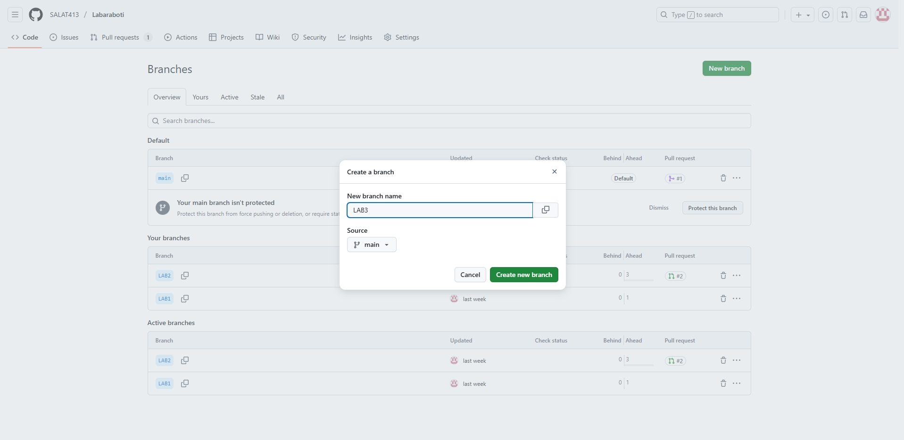
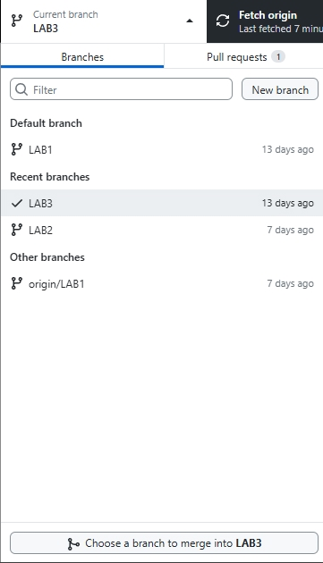
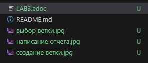

= Лабораторная работа 3
:toc: macro
:toc-title: Оглавление
:figure-caption: Рисунок

include::Titulnik_salavat.adoc[]

toc::[]

== Введение

Целью данного отчета является проверка наших действий при создании и выгрузки файла в github.

=== Процесс создания ветки

В GitHub на вкладке Code нажимаю на основную ветку main и перехожу к просмотру всех созданных мной веток.

Выбираю "New Branch" 

Ввожу название ветки (в моем случае LAB3)

Убеждаюсь, что ветка создана на основе актуальной версии main

Нажимаю "Create new Branch"

=== Выбор ветки в Github desktop

В Github desktop выбираю созданную ветку и перехожу в Visual Studio Code.

=== Создание отчета в Visual Studio Code

На данном этапе нужно приступить к оформлению отчета. Он должен включать в себя основные моменты пройденного занятия

=== Публикация проекта

После создания ветки на github и отчета в VS Code нужно пройти через несколько этапов для того чтобы опубликовать свой файл.

==== Commit

Коммит- это сохранение изменений с описанием того, что было исправлено 

В GitHub Desktop выбираю файлы для выгрузки файлов во вкладке "Changes"

Отмечаю галочками файлы для коммита

Нажимаю "Commit to [LAB3]"

==== Fetch (Получение)

Он только загружает информацию об изменениях с удаленного репозитория (например, новые коммиты, ветки), но не объединяет их с файлами. Это позволяет увидеть, что произошло на сервере, без немедленного изменения кода.

==== Pull request

Команда pull пытается автоматически объединить изменения с текущей локальной веткой. Для ее создания нужно:

Перехожу на страницу репозитория на GitHub

Нажимаю на вкладку "Pull Requests"

Кнопка "New Pull Request"

Выбираю ветки для сравнения, чтобы запустить новый запрос на извлечение, на данном этапе коммит должен быть выполнен.

Нажмите "Create Pull Request"

==== Push

Команда push отправляет локальные коммиты на удаленный репозиторий. Это этап, когда  работа становится доступной для других участников проекта.

==== Merge (Слияние)

Merge — это команда для объединения изменений из одной ветки в другую. Это ключевая операция, которая позволяет интегрировать выполненную работу (например, из LAB3) в основную ветку (main).

=== Как исправлять и закрывать комментарии к PR

Если ошибки не критичные, то исправляю их сам и сливаю(merge) файлы в основную ветку, после чего можно удалить побочную ветку.
Если же ошибки значительные, смотрю на указанные проблемы в ходе создания отчета и исправляю их. Делаю коммит, после чего исправленные файлы автоматически заменяют старые. 

== Вывод

Я показал все основные шаги для того чтобы выгрузить отчет в github.

