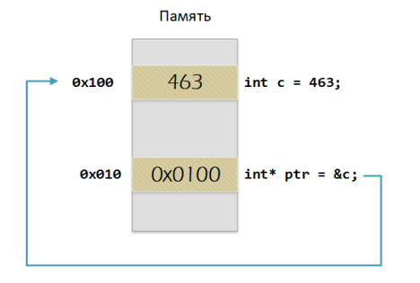
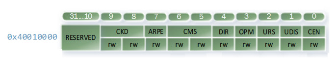
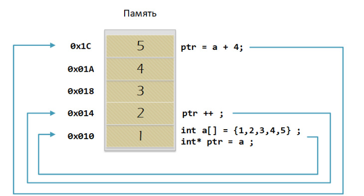

= Лабораторная работа №4
:toc: macro
:toc-title: Оглавление

include::Titulnik_salavat.adoc[]

toc::[]

== Введение

=== Тема лекции
Лекция посвящена основам портируемости программного обеспечения для встраиваемых систем, типам данных в языке C++, преобразованиям типов, работе с указателями и ссылками, а также организации памяти и регистров микроконтроллера STM32F411.

== Основные термины и определения

Портируемость (Portability) — свойство программного обеспечения, позволяющее легко переносить его на различные платформы или микроконтроллеры.

Тип данных (Data Type) — характеристика переменной, определяющая множество значений, которые она может принимать, и операции, которые над ней можно выполнять.

Указатель (Pointer) — переменная, хранящая адрес другой переменной или области памяти.

Ссылка (Reference) — псевдоним переменной, позволяющий обращаться к ней под другим именем.

Регистр (Register) — ячейка памяти внутри процессора или периферийного модуля, используемая для хранения данных или управления устройством.

== Типы данных в C++

=== Встроенные типы данных
В C++ определены базовые типы данных, такие как:

bool — логический тип (1 байт)

char — символьный тип (1 байт)

int — целочисленный тип (4 байта)

float — число с плавающей точкой (4 байта)

double — число с плавающей точкой двойной точности (8 байт)

=== Модификаторы типов
Для изменения размера и поведения типов используются модификаторы:

short — укороченный тип (2 байта)

long — удлинённый тип (8 байт)

unsigned — беззнаковый тип

=== Правила размеров типов
Размеры типов могут различаться в зависимости от архитектуры. Для обеспечения портируемости рекомендуется использовать типы с фиксированным размером из библиотеки <cstdint>:

std::uint8_t — беззнаковое 8-битное целое

std::int32_t — знаковое 32-битное целое

=== Пользовательские типы
Программист может определять собственные типы с помощью struct или class. Например, структура Complex для работы с комплексными числами.

== Преобразования типов

=== Неявное преобразование
Компилятор автоматически преобразует типы в выражениях:

cpp
int a = 3.14; // a = 3  
bool b = -4;  // b = true  
=== Явное преобразование
Для контроля над преобразованиями используются операторы приведения:

static_cast — для безопасных преобразований близких типов

reinterpret_cast — для преобразований между несвязанными типами (например, указатель в число)

const_cast — для снятия или добавления константности

dynamic_cast — для преобразований в иерархии классов

Пример:

cpp
int a = static_cast<int>(3.14); // a = 3  
auto ptr = reinterpret_cast<volatile uint32_t*>(0x40010000);  
== Указатели и ссылки

=== Указатели
Указатель — переменная, хранящая адрес другой переменной:

cpp
int c = 463;  
int* ptr = &c; // ptr хранит адрес переменной c  
Операции с указателями:

Взятие адреса: &

Разыменование: *

Арифметика указателей: +, -, ++, --

Пример работы с массивом:

cpp
int arr[] = {1, 2, 3, 4, 5};  
int* ptr = arr;  
ptr++; // теперь указывает на arr[1]  
=== Константные указатели

Указатель на константу: const int* ptr — нельзя изменить значение

Константный указатель: int* const ptr — нельзя изменить адрес

=== Ссылки
Ссылка — псевдоним переменной:

cpp
int a = 0;  
int& ref = a; // ref — ссылка на a  
ref = 10;     // теперь a = 10  
Отличия ссылок от указателей:

Ссылка должна быть инициализирована при объявлении

Нельзя изменить ссылку после инициализации

Нельзя выполнять арифметические операции над ссылками

== Регистры

=== Регистры общего назначения (РОН)
Микроконтроллер Cortex-M4 имеет 16 регистров общего назначения (R0-R15):

R0-R3, R12 — оперативные регистры (scratch)

R4-R11 — вспомогательные регистры (callee-saved)

R13 (SP) — указатель стека

R14 (LR) — регистр связи (адрес возврата)

R15 (PC) — счётчик команд

=== Регистры специального назначения
Используются для управления периферией. Каждый регистр имеет:

Адрес в памяти

Размер (обычно 32 бита)

Поля (набор битов, отвечающих за конкретную функцию)

== Операции с указателями

=== Арифметика указателей
Указатели можно складывать, вычитать и сравнивать:

cpp
int arr[] = {1, 2, 3, 4, 5};  
int* ptr = arr;  
ptr += 2; // указывает на arr[2]  
При арифметике указателей смещение происходит на размер типа:

ptr + 1 смещается на sizeof(*ptr) байт

=== Сравнение указателей
Указатели можно сравнивать с nullptr или друг с другом:

cpp
if (ptr != nullptr) {  
    // действия с указателем  
}  
== Заключение

В ходе лекции были рассмотрены ключевые аспекты портируемости программного обеспечения для встраиваемых систем:

Использование типов с фиксированным размером

Явное преобразование типов для предотвращения неожиданного поведения

Работа с указателями и ссылками для эффективного управления памятью

Организация доступа к регистрам микроконтроллера через C++-обёртки

Понимание этих концепций необходимо для создания надежного и переносимого кода для микроконтроллеров.

== Код программы для переключения состояния светодиода:

include::Код.adoc[]