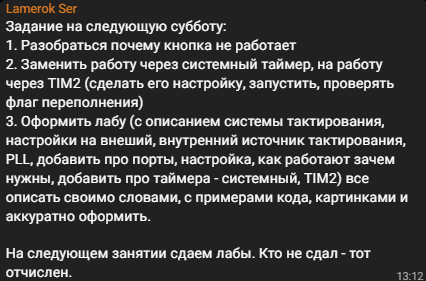

= Лабораторная работа 6
:toc: macro
:toc-title: Оглавление
:figure-caption: Рисунок

include::Titulnik_salavat.adoc[]

toc::[]

== Введение

Цель работы — сделать лабораторную работу

- переключение на PLL;
- написать о системе тактирования микроконтроллера;
- настройка портов ввода/вывода;
- работа с системным таймером (SysTick) и таймерами общего назначения (TIM2);

== 1. Система тактирования STM32F411

=== 1.1 Источники тактирования

Микроконтроллер STM32F411 поддерживает несколько источников тактовой частоты:

1. **HSI (High Speed Internal)** — внутренний RC-генератор 16 МГц.
2. **HSE (High Speed External)** — внешний кварцевый резонатор (8 МГц).
3. **PLL (Phase Locked Loop)** — система фазовой автоподстройки, набор из умножителей и делителей, где на выходы получаем частоту HSI или HSE.
4. **LSI/LSE** — низкочастотные генераторы для RTC и сторожевых таймеров.

.Структура системы тактирования STM32F411
image::Система тактирования.png[]

=== 1.2 Настройка на внешний высокочастотный генератор(HSE) с помошью PLL
Поменял значение RCC_PLLCFGR_PLLM_Values в папке rccregisters.hpp, т.к. регистр PLLM в нем имел неверную информацию.

.настройка регистра PLLM
[cols="a,a"]
|===
| image::код.png[]
| image::PLL configuration.png[]
|===

  Затем с помощью регистров PLLM, PLLN,PLLP подобрали частоту. В нашем случае необходимо получить f = 32Мгц, для этого подберем PLLM, PLLN,PLLP такие, чтобы выполнялась формула:
 f = f(PLL clock input) × (PLLN / PLLM) /PLLP​;
 32Мгц = 8*64/2/8; 

.Фазовая подстройка частоты PLL
image::формула.png[]

 Четко, все регистры подобрал. Дальше выполню все необходимые шаги для переключения на HSE
  Шаг 1: Включение внешнего кварца (HSE)
  Шаг 2: Переключение на HSE как системную частоту
  Шаг 3: Настройка PLL (Phase-Locked Loop)
  Шаг 4: Запуск PLL и переключение на него
  Шаг 5: Включение системного контроллера
[source,cpp]
----
extern "C"
{
int __low_level_init(void)
{
  RCC::CR::HSEON::On::Set();
  while (RCC::CR::HSERDY::NotReady::IsSet())
  {
  }
  RCC::CFGR::SW::Hse::Set();
  while (!RCC::CFGR::SWS::Hse::IsSet())
  {

  }  
  RCC::CR::HSION::Off::Set();
  RCC::PLLCFGR::PLLSRC::HseSource::Set(); 
  RCC::PLLCFGR::PLLM::Set(2U);     // M = 2 
  RCC::PLLCFGR::PLLN::Set(64U);    // N = 64 
  RCC::PLLCFGR::PLLP::Set(3U);     // P = 8 
  RCC::CR::PLLON::On::Set();
  while (RCC::CR::PLLRDY::Unclocked::IsSet())
  {
  }
  RCC::CFGR::SW::Pll::Set();
  while (!RCC::CFGR::SWS::Pll::IsSet())
  {
  }
  RCC::APB2ENR::SYSCFGEN::Enable::Set();
  return 1;
}
}
----

=== 1.3 Алгоритм настройки частоты

Пример настройки на HSI 16 МГц

- Шаг 1: Инициализация переменной SystemCoreClock - у нас 16Мгц
- Шаг 2: Включение внутреннего генератора HSI - HSION::On::Set()
- Шаг 3: Переключение системной частоты на HSI - SW::Hsi::Set()
- Шаг 4: Включение системного контроллера - RCC::APB2ENR::SYSCFGEN::Enable::Set();

[source,cpp]
----
std::uint32_t SystemCoreClock = 16'000'000U;
extern "C" {
int __low_level_init(void)
{
  //Switch on external 16 MHz oscillator
  RCC::CR::HSION::On::Set();
  while (RCC::CR::HSIRDY::NotReady::IsSet())
  {
  }
  //Switch system clock on external oscillator
  RCC::CFGR::SW::Hsi::Set();
  while (!RCC::CFGR::SWS::Hsi::IsSet())
  {
  }
  RCC::APB2ENR::SYSCFGEN::Enable::Set();
  return 1;
}
}
----

Ниже приведено доказательство того что плата еще работает

.плата
image::плата.jpg[]

== 2. Порты ввода/вывода (GPIO)

=== 2.1 Режимы работы портов

Каждый вывод GPIO может работать в нескольких режимах:

- **Вход** (аналоговый, цифровой с подтяжкой к питанию/земле)
- **Выход** (Push-Pull, Open-Drain)
- **Альтернативная функция** (для таймеров, UART, SPI и др.)

=== 2.2 Регистры управления

Основные регистры для настройки порта:

- **GPIOx_MODER** — выбор режима
- **GPIOx_OTYPER** — тип выхода (Push-Pull/Open-Drain)
- **GPIOx_OSPEEDR** — скорость переключения
- **GPIOx_PUPDR** — подтяжка
- **GPIOx_ODR** — выходные данные
- **GPIOx_IDR** — входные данные

Пример настройки вывода как выход Push-Pull:

[source,cpp]
----
// Включаем тактирование порта C
RCC::AHB1ENR::GPIOCEN::Enable::Set();

// Настраиваем вывод 5 как выход
GPIOC::MODER::MODER5::Output::Set();

// Тип выхода — Push-Pull (по умолчанию)
GPIOC::OTYPER::OT5::PushPull::Set();

// Скорость переключения — высокая
GPIOC::OSPEEDR::OSPEEDR5::VeryHigh::Set();

// Устанавливаем высокий уровень
GPIOC::ODR::ODR5::High::Set();
----

== 3. Таймеры

=== 3.1 Системный таймер (SysTick)

Самым простым таймером является - системный, встроенный в ядро ARMv7, на котором построено ядро CortexM4 и наш микроконтроллер stm32F411

**Регистры SysTick**:

- **SYST_CSR** — управление
- **SYST_LOAD** — значение перезагрузки
- **SYST_VAL** — текущее значение

Пример настройки задержки на 150 мс при частоте 32 МГц:

[source,cpp]
----
void tim2_delay(std::uint32_t milliseconds)
{
  TIM2::CR1::URS::OverflowEvent::Set();
  TIM2::PSC::Write(31999U);
  TIM2::ARR::Write(milliseconds - 1U);
  TIM2::SR::UIF::NoInterruptPending::Set();
  TIM2::CNT::Write(0);
  TIM2::CR1::CEN::Enable::Set();
  
  while (!TIM2::SR::UIF::InterruptPending::IsSet())
  {
  }
  TIM2::CR1::CEN::Disable::Set();
}
...
    tim2_delay(150);
----

=== 3.2 Таймер общего назначения TIM2

TIM2 — 32-битный таймер, может работать в режимах:

- Счёт вверх/вниз
- ШИМ-генерация
- Захват/сравнение

**Основные регистры**:

- **TIM2_CR1** — управление
- **TIM2_PSC** — предделитель частоты
- **TIM2_ARR** — авто-перезагрузка
- **TIM2_CNT** — счётчик
- **TIM2_SR** — статус

image::регистры.png[]
*Рисунок 3.1: Структура регистров TIM2*

== Заключение
Лабораторная работа выполнена успешно. Переключился на внешний генератор HSE 8 МГц и умножил частоту через PLL до 32 МГц. Реализовал точную задержку 150 мс с помощью таймера TIM2. 

Кнопка не работала, потому что студент, который расшаривал экран нажимал на кнопку reset, а не UserButton.

=== Полный код программы

[source,cpp]

----
#include "iostream" //for std::cout
#include "rccregisters.hpp" // for RCC
#include "gpioaregisters.hpp" // for GPIOA
#include "gpiocregisters.hpp" // for GPIOC
#include <array> // for std::array
#include "Led.h" // for Led, ILedToggable, ILedOnOff
#include "OptimizedLed.h" // for OptimizedLed
#include "CommonMode.h"
#include "RunningLightMode.h"
#include "FadeGlowMode.h"
#include "ChessMode.h"
#include "UserButton.h"
#include "ModeController.h"
#include "tim2registers.hpp" // ??? TIM2

std::uint32_t SystemCoreClock = 32'000'000U;

extern "C"
{
int __low_level_init(void)
{
  RCC::CR::HSEON::On::Set();
  while (RCC::CR::HSERDY::NotReady::IsSet())
  {
  }
  RCC::CFGR::SW::Hse::Set();
  while (!RCC::CFGR::SWS::Hse::IsSet())
  {
  }  
  RCC::CR::HSION::Off::Set();
  RCC::PLLCFGR::PLLSRC::HseSource::Set(); 
  RCC::PLLCFGR::PLLM::Set(2U);     // M = 2 
  RCC::PLLCFGR::PLLN::Set(64U);    // N = 64 
  RCC::PLLCFGR::PLLP::Set(3U);     // P = 8 
  RCC::CR::PLLON::On::Set();
  while (RCC::CR::PLLRDY::Unclocked::IsSet())
  {
  }
  RCC::CFGR::SW::Pll::Set();
  while (!RCC::CFGR::SWS::Pll::IsSet())
  {
  }
  RCC::APB2ENR::SYSCFGEN::Enable::Set();
  
  // ????????? ???????????? ??? TIM2
  RCC::APB1ENR::TIM2EN::Enable::Set();
  return 1;
}
}
void tim2_delay(std::uint32_t milliseconds)
{
  TIM2::CR1::URS::OverflowEvent::Set();
  TIM2::PSC::Write(31999U); // ??? 1 ?? ??? 32 ???
  TIM2::ARR::Write(milliseconds - 1U);
  TIM2::SR::UIF::NoInterruptPending::Set();
  TIM2::CNT::Write(0);
  TIM2::CR1::CEN::Enable::Set();
  
  while (!TIM2::SR::UIF::InterruptPending::IsSet())
  {
  }
  TIM2::CR1::CEN::Disable::Set();
}
constexpr std::uint32_t buttonPinNum = 13;
constexpr std::uint32_t portCIdrAddress = 0x40020810U;
UserButton userButton(buttonPinNum, portCIdrAddress);

Led led1(5, 0x40020814U);
Led led2(8, 0x40020814U);
Led led3(9, 0x40020814U);
OptimizedLed<0x40020014U, 5> led4;

tLeds leds = 
{
  &led1,
  &led2,
  &led3,
  &led4
};
tLedsOnOff ledsOnOff = 
{
  &led1,
  &led2,
  &led3,
  &led4
};
RunningLightMode runningLightMode(leds, ledsOnOff);
FadeGlowMode fadeGlowMode(leds, ledsOnOff);
ChessMode chessMode(leds, ledsOnOff);

tModes modes
{
  &runningLightMode,
  &fadeGlowMode,
  &chessMode
};
ModeController modeController(modes);

int main()
{ 
  RCC::AHB1ENR::GPIOAEN::Enable::Set();
  RCC::AHB1ENR::GPIOCEN::Enable::Set();
  GPIOA::MODER::MODER5::Output::Set();
  GPIOC::MODER::MODER5::Output::Set();
  GPIOC::MODER::MODER8::Output::Set();
  GPIOC::MODER::MODER9::Output::Set();
  for(;;)
  {   
    if (userButton.WasPressed())
    {   
      modeController.SwitchMode(); 
    }
    modeController.RunCurrentMode(); 
    tim2_delay(150);
  }
  
  return 1;
}
----