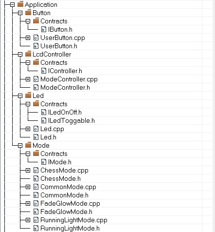

= Лабораторная работа №5
:toc: macro
:toc-title: Оглавление

include::Title.adoc[]

toc::[]

== Введение

Данная работа представляет собой разработку системы управления светодиодами для микроконтроллера STM32F411RE. Основной задачей являлось создание модульной и расширяемой архитектуры, поддерживающей multiple режимы работы светодиодов с возможностью простого добавления новых функциональных возможностей.

== Архитектурное решение и принцип работы

=== Обзор системы

Система реализует контроллер, управляющий четырьмя светодиодами через три различных алгоритма работы. Архитектура построена на принципах объектно-ориентированного программирования с четким разделением ответственности между компонентами.

=== Основной алгоритм работы

[source,cpp]
----
for(;;)
{   
    if (userButton.WasPressed())
    {
        modeController.SwitchMode(); 
    }
    delay(500000);
    modeController.RunCurrentMode(); 
}
----

Программа работает в бесконечном цикле, постоянно проверяя состояние пользовательской кнопки. При обнаружении нажатия происходит переключение на следующий режим работы. После задержки выполняется логика текущего активного режима.

=== Реализованные режимы работы

* **RunningLightMode** — алгоритм последовательного переключения светодиодов ("бегущий огонь")
* **FadeGlowMode** — алгоритм синхронного управления всеми светодиодами
* **ChessMode** — алгоритм попеременного включения светодиодов в шахматном порядке

== Проектирование интерфейсов

=== Эволюция интерфейса IButton

В процессе проектирования рассматривались различные варианты интерфейса для работы с кнопкой. Изначальный подход предполагал создание расширенного API с методами для определения различных состояний кнопки. Однако анализ требований системы показал, что достаточно информации о факте нажатия.

[source,cpp]
----
class IButton {
public:
    virtual bool WasPressed() const = 0;
};
----

**Обоснование выбора:**
- Минималистичный дизайн соответствует принципу единственной ответственности
- Упрощение реализации для различных аппаратных платформ
- Возможность изоляции компонента для модульного тестирования
- Снижение связанности между компонентами системы

=== Разделение интерфейсов управления светодиодами

Первоначальный подход предполагал создание унифицированного интерфейса для управления светодиодами. Однако анализ сценариев использования выявил необходимость разделения функциональности.

[source,cpp]
----
class ILedToggable {
public:
    virtual void Toggle() const = 0;
};

class ILedOnOff {
public:
    virtual void On() const = 0;
    virtual void Off() const = 0;
};
----

**Техническое обоснование разделения:**

1. **RunningLightMode** использует исключительно операцию переключения состояния
2. **ChessMode** требует явного управления состоянием каждого светодиода
3. Соблюдение принципа разделения интерфейсов (Interface Segregation Principle)
4. Предотвращение загрязнения API неиспользуемыми методами

== Процесс определения абстракций

Проектирование архитектуры системы осуществлялось итеративно, с последовательным выделением абстракций из первоначальной монолитной реализации.

=== Начальная архитектура

Первоначальная реализация представляла собой единый модуль, содержащий:
- Логику управления аппаратными светодиодами
- Обработку пользовательского ввода
- Реализацию всех алгоритмов работы

Данный подход продемонстрировал существенные ограничения при попытке модификации и расширения функциональности.

=== Идентификация ключевых абстракций

В процессе рефакторинга были выделены следующие основные абстракции:

1. **Управление светодиодами** — изолировано от бизнес-логики режимов
2. **Обработка пользовательского ввода** — выделена в независимый компонент
3. **Реализация алгоритмов работы** — унифицирована через общий интерфейс

=== Создание иерархии CommonMode

Анализ дублирующегося кода в различных режимах привел к созданию базового класса:

[source,cpp]
----
class CommonMode: public IMode {
public:
    CommonMode(const tLeds& leds, const tLedsOnOff& ledsOnOff);
    void Init() override;
protected:
    const tLeds& mLeds;
    const tLedsOnOff& mLedsOnOff;
    std::uint32_t mCurrentLedNumber;
};
----

Данное решение позволило устранить дублирование кода и стандартизировать процесс создания новых режимов.

== Эволюция архитектуры и применение паттерна "Стратегия"

Архитектурная эволюция системы естественным образом привела к реализации паттерна "Стратегия", хотя изначально применение данного паттерна не планировалось.

=== Исходная архитектура управления режимами

Первоначально управление режимами было реализовано с использованием конструкции switch-case:

[source,cpp]
----
void RunCurrentMode() {
    switch(mCurrentMode) {
        case 0:
            // Реализация режима 1
            break;
        case 1:
            // Реализация режима 2
            break;
        case 2:
            // Реализация режима 3
            break;
    }
}
----

Данный подход создавал существенные ограничения для расширения и сопровождения системы.

=== Анализ проблем исходного подхода

Были идентифицированы следующие недостатки:

- **Нарушение принципа открытости/закрытости** — добавление нового режима требовало модификации существующего кода
- **Сложность тестирования** — невозможность изолированного тестирования отдельных алгоритмов
- **Высокая связанность** — код управления режимами был тесно связан с их реализацией
- **Сложность сопровождения** — концентрация логики в одном модуле

=== Архитектурная трансформация

В процессе анализа было установлено, что различные режимы работы представляют собой альтернативные алгоритмы достижения общей цели — управления светодиодами. Это понимание привело к созданию унифицированного интерфейса:

[source,cpp]
----
class IMode {
public:
    virtual void Init() = 0;
    virtual void Execute() = 0;
};
----

Контроллер режимов был реорганизован для работы с абстракциями:

[source,cpp]
----
void ModeController::RunCurrentMode() {
    mModes[mCurrentMode]->Execute();
}
----

=== Реализация конкретных стратегий

**RunningLightMode** — алгоритм последовательного переключения:

[source,cpp]
----
void RunningLightMode::Execute() {
    mLeds[mCurrentLedNumber++]->Toggle();
    if (mCurrentLedNumber == std::size(mLeds)) {
        mCurrentLedNumber = 0;
    }
}
----

**ChessMode** — алгоритм шахматного порядка:

[source,cpp]
----
void ChessMode::Execute() {
    for (std::size_t i = 0; i < std::size(mLeds); ++i) {
        if ((i % 2 == 0) == oddPhase)
            mLedsOnOff[i]->On();
        else
            mLedsOnOff[i]->Off();
    }
    oddPhase = !oddPhase;
}

----

image::шахматы.jpg[]

=== Преимущества полученной архитектуры

Реализация паттерна "Стратегия" обеспечила следующие преимущества:

1. **Расширяемость** — добавление нового режима требует создания класса, реализующего интерфейс IMode
2. **Тестируемость** — каждый алгоритм может тестироваться изолированно
3. **Сопровождаемость** — логика каждого режима инкапсулирована в отдельном классе
4. **Слабая связанность** — контроллер не зависит от конкретных реализаций алгоритмов

=== Диаграмма классов системы

На представленной UML диаграмме классов отображена архитектура системы управления светодиодами. Диаграмма демонстрирует следующие ключевые аспекты:

- **Структура интерфейсов** и их реализаций
- **Иерархия наследования** с базовым классом CommonMode
- **Взаимосвязи между компонентами** системы
- **Применение принципов SOLID** в проектировании

Диаграмма наглядно иллюстрирует архитектурные решения, принятые в процессе проектирования системы.

image::UML.jpg[]

== Заключение

Разработанная архитектура демонстрирует эффективное применение объектно-ориентированных принципов проектирования в области встраиваемых систем. Ключевыми достижениями являются:

- Четкое разделение ответственности между компонентами
- Минималистичный дизайн интерфейсов, ориентированный на конкретные потребности системы
- Гибкая архитектура, поддерживающая простое расширение функциональности
- Естественное применение паттернов проектирования через практический анализ проблем

Полученный опыт подтверждает, что тщательный анализ требований и итеративный процесс рефакторинга позволяют создавать чистую и поддерживаемую архитектуру даже в ограниченной среде встраиваемых систем.

== Приложение

=== Полный код программы

[source,cpp]
----
include::Laba5\main.cpp[]
----

=== Структура проекта

=== Интерфейсы и реализации

IButton.h
[source,cpp]
----
include::Laba5\\Application\\Button\\Contrats\\IButton.h[]
----

UserButton.h
[source,cpp]
----
include::Laba5\\Application\\Button\\UserButton.h[]
----

UserButton.cpp
[source,cpp]
----
include::Laba5\\Application\\Button\\UserButton.cpp[]
----

IController.h
[source,cpp]
----
include::Laba5\Application\Led\Contracts\ILedOnOff.h[]
----

=== Компоненты управления

ModeController.h
[source,cpp]
----
include::Laba5\\Application\\LcdController\\ModeController.h[]
----

ModeController.cpp
[source,cpp]
----
include::Laba5\\Application\\LcdController\\ModeController.cpp[]
----

=== Абстракции светодиодов

ILedOnOff.h
[source,cpp]
----
include::Laba5\Application\Led\Contracts\ILedOnOff.h[]
----

ILedToggable.h
[source,cpp]
----
include::Laba5\Application\Led\Contracts\ILedToggable.h[]
----

Led.h
[source,cpp]
----
include::Laba5\\Application\\Led\\Led.h[]
----

Led.cpp
[source,cpp]
----
include::Laba5\\Application\\Led\\Led.cpp[]
----

OptimizedLed.h
[source,cpp]
----
include::Laba5\\Application\\Led\\OptimizedLed.h[]
----

=== Реализации режимов работы

CommonMode.h
[source,cpp]
----
include::Laba5\\Application\\Mode\\CommonMode.h[]
----

CommonMode.cpp
[source,cpp]
----
include::Laba5\\Application\\Mode\\CommonMode.cpp[]
----

RunningLightMode.h
[source,cpp]
----
include::Laba5\\Application\\Mode\\RunningLightMode.h[]
----

RunningLightMode.cpp
[source,cpp]
----
include::Laba5\\Application\\Mode\\RunningLightMode.cpp[]
----

FadeGlowMode.h
[source,cpp]
----
include::Laba5\\Application\\Mode\\FadeGlowMode.h[]
----

FadeGlowMode.cpp
[source,cpp]
----
include::Laba5\\Application\\Mode\\FadeGlowMode.cpp[]
----

ChessMode.h
[source,cpp]
----
include::Laba5\\Application\\Mode\\ChessMode.h[]
----

ChessMode.cpp
[source,cpp]
----
include::Laba5\\Application\\Mode\\ChessMode.cpp[]
----