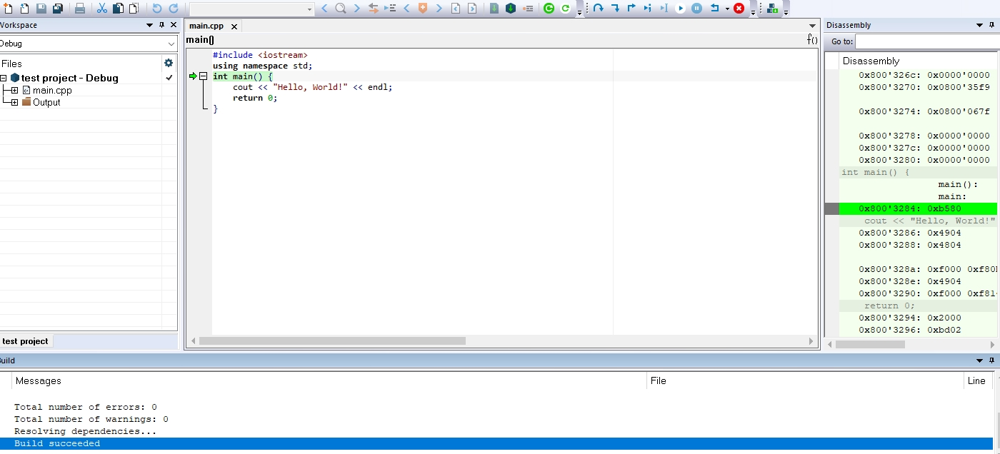
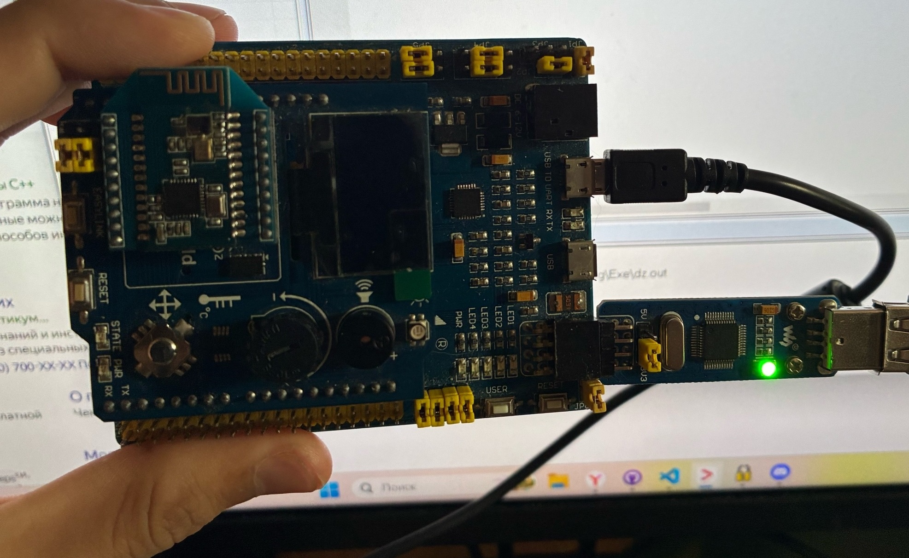

= Лабораторная работа 2
:toc: macro
:toc-title: Оглавление

include::Titulnik_salavat.adoc[]

toc::[]
== Введение
=== Тема лекции
Лекция посвящена основам разработки программного обеспечения для встраиваемых систем (embedded systems) с использованием интегрированной среды разработки IAR Embedded Workbench for ARM. Рассматриваются основные понятия, этапы создания программы и структура проекта для микроконтроллера STM32F411RE.

== Основные термины и определения

Встраиваемая система (Embedded System): Специализированная микропроцессорная система, встроенная в управляемое ею устройство.

Микроконтроллер (MCU): Однокристальный компьютер, объединяющий процессор, память и периферийные устройства для выполнения конкретных задач.

Интегрированная среда разработки (IDE): Комплекс программных средств (редактор, компилятор, отладчик, система сборки) для разработки ПО. IAR Embedded Workbench — пример профессиональной IDE для embedded-разработки.

Аппаратный стек (Stack): Область памяти, организованная по принципу LIFO, управляемая указателем стека (SP). Используется для хранения адресов возврата, локальных переменных и контекста при прерываниях.

== IAR Embedded Workbench: Назначение и процесс разработки

=== Что такое IAR EW и для чего она нужна?
IAR Embedded Workbench — это мощная IDE, предназначенная для разработки, компиляции и отладки ПО для микроконтроллеров. Это основной инструмент для создания "прошивок" (firmware).

Ключевые компоненты IAR EW:

Компилятор: Транслирует код C/C++ в машинные инструкции для конкретного MCU.

Линковщик (Компоновщик): Объединяет объектные файлы и библиотеки в единый исполняемый модуль, распределяя код и данные по памяти согласно настройкам.

Отладчик C-SPY: Позволяет отлаживать программу как на симуляторе, так и на реальном железе с помощью внутрисхемных отладчиков (например, ST-LINK).

== Практическое знакомство с IAR Embedded Workbench

В рамках данной работы я познакомился со средой разработки IAR Embedded Workbench. Была выполнена установка среды, создан новый проект для микроконтроллера STM32F411RE, настроена структура папок и параметры линковщика.

Ключевые выполненные шаги:

Создание проекта по шаблону C++ - main.

Настройка аппаратного отладчика (ST-LINK) для загрузки программы на реальный микроконтроллер.

Написание простейшего тестового приложения, включающего настройку тактирования и управление выводом порта ввода-вывода.

Результатом успешной настройки и компиляции проекта является сообщение Total number of errors: 0 в окне сборки. На рисунке  представлен скриншот, подтверждающий успешную компиляцию проекта без ошибок.

=== Процесс создания программы
Процесс преобразования исходного кода в прошиваемый образ состоит из двух основных этапов:

Трансляция: Компилятор преобразует исходные файлы (*.c, *.cpp) в объектные файлы (*.o).

Компоновка (Линковка): Линковщик принимает объектные файлы, библиотеки и конфигурационный файл (.icf), который описывает карту памяти MCU. Результат — исполняемый файл в формате ELF, готовый для прошивки.

== Запуск программы: что происходит до main()

Перед выполнением функции main() микроконтроллер выполняет критически важные действия по инициализации, описанные в файле startup (например, startup_stm32f411.cpp):

Инициализация указателя стека (SP): Указатель стека устанавливается на вершину области памяти, выделенной под стек.

Инициализация данных:

Обнуление глобальных и статических переменных, объявленных без инициализации (секция .bss).

Копирование начальных значений в глобальные и статические переменные, которые были проинициализированы (например, int i = 5;). Значения копируются из ПЗУ (секция .data_init) в ОЗУ (секция .data).

Вызов main(): Только после этого управление передается в функцию main().

== Организация памяти и настройка проекта

=== Архитектура памяти
Микроконтроллеры ARM используют модифицированную Гарвардскую архитектуру, где команды и данные используют единое адресное пространство, но раздельные шины для доступа. Линковщик с помощью файла .icf распределяет, какие сегменты кода и данных будут размещены в ПЗУ (ROM) и ОЗУ (RAM).

=== Сегменты памяти
Компилятор и линковщик работают с сегментами (секциями) памяти:

.text: Исполняемый код программы.

.data: Инициализированные переменные (хранятся в RAM, начальные значения — в ROM).

.bss: Неинициализированные переменные (обнуляются при старте).

.stack: Память для стека.

.heap: Память для динамического выделения (куча).

=== Настройка стека и кучи

Стек (Stack): Размер стека задается в настройках линковщика. IAR EW имеет встроенный анализатор использования стека, который помогает оценить необходимый размер. Стек обязателен для работы программы.

Куча (Heap): Используется для динамического выделения памяти (оператор new). В надежном ПО использование кучи часто не рекомендуется из-за рисков фрагментации и непредсказуемого поведения. В учебных проектах размер кучи можно установить в 0, если динамическая память не используется.

== Практическая часть: Структура проекта

Для поддержания порядка код проекта следует структурировать:

AbstractHardware/: Код, зависящий от конкретного микроконтроллера (регистры, драйверы).

Application/: Логика приложения, независимая от аппаратной части.

Common/: Общие вспомогательные файлы.

FreeRTOS/: Файлы операционной системы реального времени (если используется).

Файл startup_stm32f411.cpp, содержащий таблицу векторов прерываний и код инициализации, должен быть добавлен в проект.

== Вывод

IAR Embedded Workbench — это комплексное решение для профессиональной разработки встраиваемого ПО. Ключ к успеху — понимание не только языка C/C++, но и низкоуровневых процессов: инициализации микроконтроллера, организации памяти и работы инструментов (компилятора, линковщика). Правильная настройка проекта и аккуратная структура кода являются обязательными условиями создания надежных и сопровождаемых embedded-приложений.

