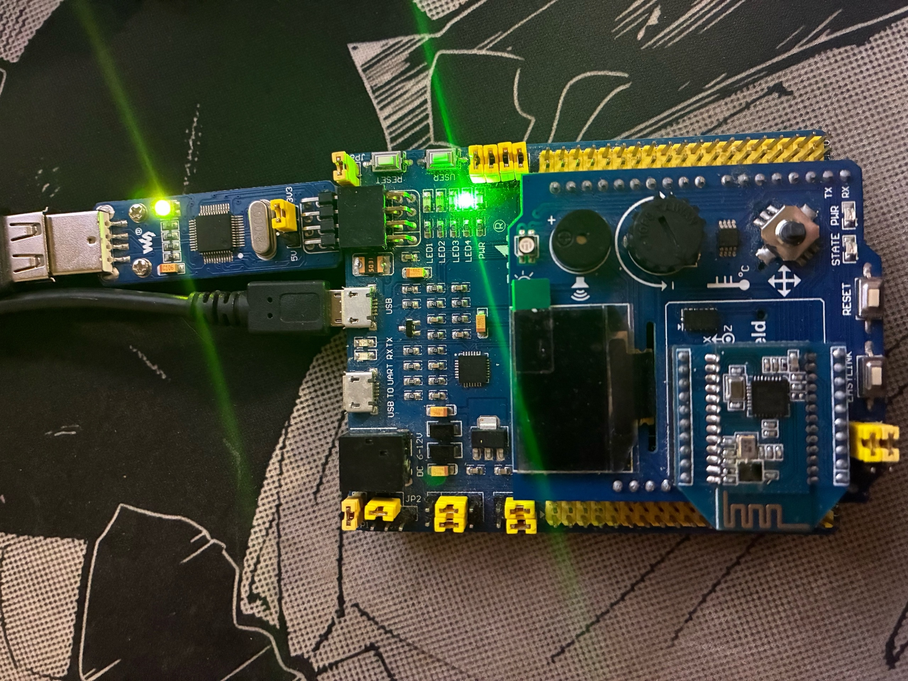

[source,cpp]
----
#include <iostream> 
#include "rccregisters.hpp"
#include "gpioaregisters.hpp"
#include "gpiocregisters.hpp" 

std::uint32_t SystemCoreClock = 16'000'000U;

extern "C" {
int __low_level_init(void)
{
  RCC::CR::HSION::On::Set();
  while (RCC::CR::HSIRDY::NotReady::IsSet())
  {

  }
  RCC::CFGR::SW::Hsi::Set();
  while (!RCC::CFGR::SWS::Hsi::IsSet())
  {

  }
  RCC::APB2ENR::SYSCFGEN::Enable::Set();

  return 1;
}
}
int main()
{  
  RCC::AHB1ENR::GPIOAEN::Enable::Set() ;
  RCC::AHB1ENR::GPIOCEN::Enable::Set() ;
  GPIOA::MODER::MODER5::Output::Set() ;
  GPIOC::MODER::MODER5::Output::Set() ;
  GPIOC::MODER::MODER8::Output::Set() ;
  GPIOC::MODER::MODER9::Output::Set() ;
  bool flag = false;
  volatile uint32_t counter = 0;
  bool wasButtonPressed = false;
  for(;;)
  {
    std::uint32_t* const gpiocOdrPtr = reinterpret_cast<std::uint32_t*>(0x40020814);
    std::uint32_t* const gpiocIdrPtr = reinterpret_cast<std::uint32_t*>(0x40020810);
    counter++;
    if (counter % 5000 == 0)
    {
      auto volatile idrValue = *gpiocIdrPtr;
      bool isButtonPressed = ((idrValue & (1<<13)) == 0);
      if (isButtonPressed && !wasButtonPressed)
      {
        flag = !flag;
        if (flag)
        {
          *gpiocOdrPtr |= (1<<5);
        }
        else
        {
          *gpiocOdrPtr &= ~(1<<5);
        }
      }
      wasButtonPressed = isButtonPressed;
    }
  }
  
  return 1;
}

----